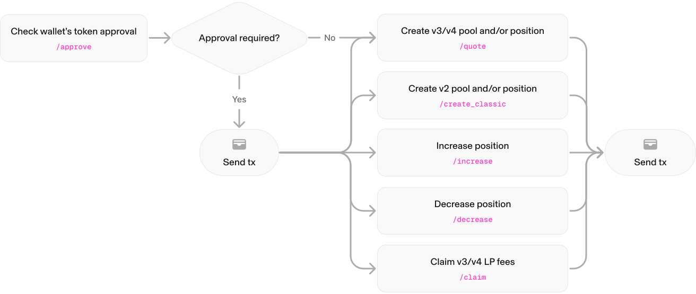

## High Level Message Flow

The following diagram illustrates how an integrator starting with no liquidity position can create and manage a liquidity position. Steps in gray are taken through the Uniswap Labs API and steps in red are written to the blockchain by the integrator.

1. The integrator checks if they have the necessary approval to send token(s) to the desired pool using a [`/check_approval`](/docs/api-reference/check_lp_approval) request.
   1. If the approval is not yet in place, a fully-formed transaction is returned for the integrator to sign for each un-approved token.
2. The integrator then proposes the position they would like to create using the [`/create`](/docs/api-reference/create_position) request. 
   1. The API checks if the pool already exists. If the pool does not exist, the response returns a fully-formed transaction to create the pool which the user must sign.
   2. The API also returns the fully-formed transaction to create a position (e.g. add liquidity to a pool), which the user must sign.
3. Over time the integrator may want to perform additional actions to manage their liquidity pool (LP) positions:
   1. Commonly, liquidity providers will want to claim their earned fees from the pool using the [`/claim_fees`](/docs/api-reference/claim_fees) request.
   2. Integrators may want to change the allocation of tokens they have made to a pool. Integrators can add additional tokens to a pool using the [`/increase`](/docs/api-reference/increase_position) request and can reduce or fully withdraw their position using the [`/decrease`](/docs/api-reference/decrease_position) endpoint.

If you are ready to build, you can grab an API key from the [Uniswap Developer Platform](https://developers.uniswap.org/dashboard/welcome?utm_medium=eco&utm_source=platform&utm_campaign=20260428-liquidity-api&utm_content=getting-started&utm_term=self-serve).