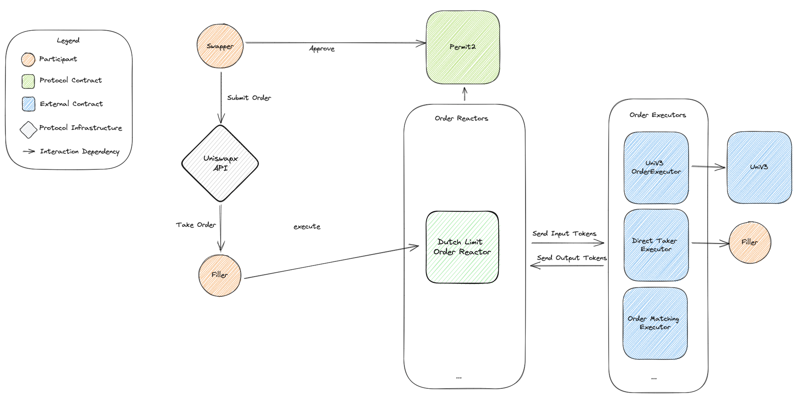

## Reactors

Order Reactors _settle_ UniswapX orders. They validate a specific order type, resolve inputs and outputs, execute against a filler strategy, and verify fulfillment.

Reactors process orders using the following steps:
- Validate the order
- Resolve the order into inputs and outputs
- Pull input tokens from the swapper to the fill contract using `Permit2` and `permitWitnessTransferFrom` with the order as witness
- Call `reactorCallback` on the fill contract
- Verify that the output tokens were received by the output recipients

Reactors implement the [IReactor](https://github.com/Uniswap/UniswapX/blob/main/src/interfaces/IReactor.sol) interface which abstracts the specifics of the order specification. This allows for different reactor implementations with different order formats to be used with the same interface, allowing for shared infrastructure and easy extension by fillers.

Current reactor implementations:

| Reactor | Description |
|---|---|
| [`PriorityOrderReactor`](https://github.com/Uniswap/UniswapX/blob/main/src/reactors/PriorityOrderReactor.sol) | Settles orders via filler competition using priority gas fees |
| [`V2DutchOrderReactor`](https://github.com/Uniswap/UniswapX/blob/main/src/reactors/V2DutchOrderReactor.sol) | Settles linear decay Dutch orders using block timestamp for auction decay |
| [`V3DutchOrderReactor`](https://github.com/Uniswap/UniswapX/blob/main/src/reactors/V3DutchOrderReactor.sol) | Settles linear decay Dutch orders using block number instead of timestamp, enabling finer granularity on chains like Arbitrum (250ms block resolution) |
| [`ExclusiveDutchOrderReactor`](https://github.com/Uniswap/UniswapX/blob/main/src/reactors/ExclusiveDutchOrderReactor.sol) | Settles linear decay Dutch orders with exclusivity period before decay begins |
| [`LimitOrderReactor`](https://github.com/Uniswap/UniswapX/blob/main/src/reactors/LimitOrderReactor.sol) | Settles simple static limit orders |

## Fill Contracts

Order fill contracts _fill_ UniswapX orders. They specify the filler's strategy for fulfilling orders and are called by the reactor with `reactorCallback`.

Sample fill contract implementations are provided in the [UniswapX repo](https://github.com/Uniswap/UniswapX):

| Contract | Description |
|---|---|
| [`SwapRouter02Executor`](https://github.com/Uniswap/UniswapX/blob/main/src/sample-executors/SwapRouter02Executor.sol) | Fills orders using Uniswap v2 and Uniswap v3 via the `SwapRouter02` router |

For filler implementation and operational guidance, see the [Filler Integration Overview](/docs/liquidity/uniswapx/filling/overview).

## Direct Fill

If a filler wants to fill orders using funds on-hand rather than a fill contract, they can do so gas efficiently using the `directFill` macro by specifying `address(1)` as the fill contract. This will pull tokens from the filler using `msg.sender` to satisfy the order outputs.

<Callout type="info" title="">
More details on the UniswapX protocol are available in the [UniswapX Whitepaper](https://uniswap.org/whitepaper-uniswapx.pdf) and the [UniswapX Repo](https://github.com/Uniswap/UniswapX).
</Callout>
