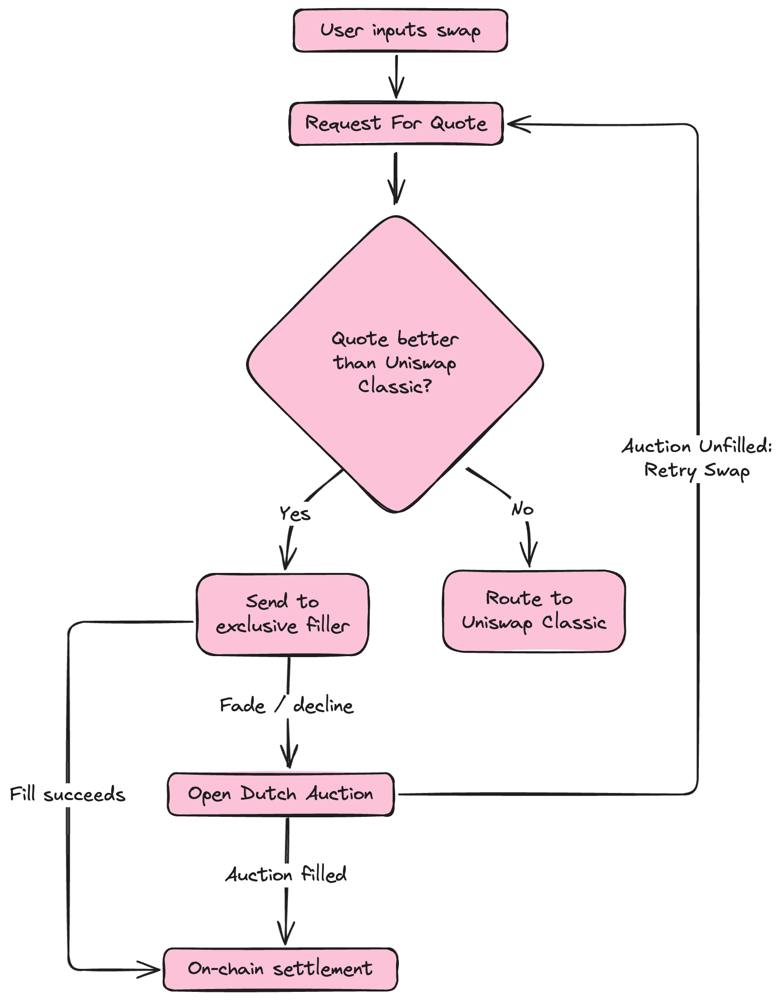

import bolt from './images/bolt.svg'

UniswapX uses different auction mechanisms across supported chains, each tuned to chain characteristics. Understanding these differences is important when integrating UniswapX on each chain.

The following table summarizes the auction mechanisms on each chain.

| Chain | Auction Type | Reactor | Timing Mechanism |
|-------|-------------|---------|------------------|
| **Ethereum** | RFQ + Exclusive Dutch Auction | Dutch V2 | Time-based: exclusivity window, then decay (`decayStartTime`) |
| **Arbitrum, Avalanche, Base, BNB Smart Chain, Robinhood Chain, Tempo, Unichain** | RFQ + Exclusive Dutch Auction | Dutch V3 | Block-based: exclusivity window, then decay (`decayStartBlock`) |

UniswapX uses the same RFQ and exclusive Dutch auction model on every supported chain. The only difference is how timing is measured: Ethereum measures the exclusivity window and decay in time, while the other chains measure them in block numbers.

Regardless of their differences, all auctions do not require users to pay gas. Gas fees are wrapped into the final price and are paid by the filler, and failed swaps do not incur any fees at all.

## Ethereum: RFQ + Exclusive Dutch Auction

<Callout type="note" title="Summary">
Two-phase auction system with exclusive filling rights for winning quoters.
</Callout>

### Key terms

- **Request for Quote (RFQ)**: A process of crowdsourcing quotes for price discovery.
- **Fillers**: Parties who settle orders programmatically. These participants may also be called market makers, searchers, solvers, or MEV bots.
- **Quoters**: A subset of fillers that provide quotes in the RFQ process.
- **Classic Quote**: The quote from the AMM route.
- **Soft Quote**: An indicative quote used to show users their expected swap result.
- **Hard Quote**: The final quote collected to parameterize the auction before posting onchain.

UniswapX on Ethereum uses a two-phase auction system that balances execution quality with gas efficiency. Due to Ethereum's higher gas costs and 12-second block time, the system uses RFQ to improve pricing before users submit onchain transactions. This approach grants temporary exclusivity to winning quoters, then falls back to an open Dutch auction if the exclusive filler does not settle. The two-phase design reduces failed transactions while preserving market competition.

### Quote discovery (steps 1 to 3)

1. User goes into the interface and inputs a swap.
2. Uniswap Labs fetches two quotes in parallel:
    - **Classic Quote**: A quote from classic Uniswap Protocol pools.
    - **UniswapX Quote**: A quote determined via a Request for Quote (RFQ) process with quoters. Because of the nature of the system, this set of market makers is permissioned and known to Labs.
3. Uniswap Labs selects the best quote (soft quote) returned and compares it to the Classic Quote. If the UniswapX quote is better, the user is shown a purple lightning bolt , indicating that they will be swapping through X.

### Order execution (steps 4 to 5)

4. The UniswapX Quote contains auction parameters, which the user signs to create a gasless offchain message. This signed message commits to the auction parameters and defines a slippage tolerance, representing the minimum amount the swapper will accept.
5. This gets sent to Uniswap Labs' server, which requests a final "hard quote" from the group of quoters. Whichever quote (hard quote) is highest wins exclusivity and gives the quoter a short exclusivity window to fill the order (sending users their tokens and settling the transaction).
   - If no quoter provides the amount that the swapper had signed for (e.g. prices moved), then the order is sent out without exclusivity, meaning anyone can fill the order.
   - Orders may use **soft exclusivity**, where non-exclusive fillers can override the exclusivity window by providing additional tokens to the swapper (determined by the `exclusivityOverrideBps` parameter). This means the swapper is never worse off if exclusivity is overridden, as they receive at least as much as the exclusive price, and potentially more.

<Callout type="info" title="Exclusivity and decay timing by chain">
This same RFQ and exclusive Dutch auction also runs on other UniswapX chains, settled through the [DutchV3 reactor](https://github.com/Uniswap/UniswapX/blob/main/src/reactors/V3DutchOrderReactor.sol). The mechanism is identical across chains; only the timing differs, and the cosigner sets the window per order:

- **Ethereum**: time-based. The exclusivity window is currently about 24 seconds (2 blocks).
- **Chains using the DutchV3 reactor**: block-based. The exclusivity window and decay are measured in block numbers, set by the cosigner per order. The real-time duration depends on each chain's non-flashblock block time.
</Callout>

### Fallback mechanisms (steps 6 to 7)

6. Sometimes the market maker who won the RFQ does not want to fill the order anymore (for example, price moved against them). This is called "fading." The system can penalize quoters who fade too frequently by ignoring their quotes for a period of time.
7. If the exclusive filler fades or there is no exclusive filler, the system proceeds to a Dutch Auction (a descending price auction), where the user's transaction is posted for anyone to permissionlessly fill the order.
    - The auction starts at or slightly below the quote price that the quoter faded.
    - Every block, the price decreases by a small amount.
    - This can improve outcomes through competition because market makers are incentivized to fill when pricing becomes profitable for them.
    - In this flow, market makers in step 2 are "Quoters" because they respond to RFQ requests. Market makers in step 6 are "Fillers." Quoters are permissioned, while fillers are permissionless.

<Callout title="Cosigners" type="info">
Cosigners update auction parameters to reflect real-time prices, compensating for the delay between quoting and signing (which can be up to 30 seconds). They set the auction start block and adjust pricing within the user's signed parameters, while never exceeding the user's slippage tolerance. See the technical overview of [UniswapX RFQ](/docs/liquidity/uniswapx/concepts/uniswaprfq) for details on how cosigners work in practice.

Currently, the Uniswap Interface and Uniswap API set the cosigner to Uniswap Labs, though this may be updated in the future.
</Callout>

## DutchV3 Chains: RFQ + Exclusive Dutch Auction (Block-Based)

<Callout type="note" title="Summary">
The same RFQ and exclusive Dutch auction as Ethereum, with exclusivity and decay measured in block numbers instead of time.
</Callout>

Arbitrum, Avalanche, Base, BNB Smart Chain, Robinhood Chain, Tempo, and Unichain run the same model described above for Ethereum: a winning quoter from the RFQ holds an exclusivity window, and the order then decays in an open Dutch auction. These chains settle through the [DutchV3 reactor](https://github.com/Uniswap/UniswapX/blob/main/src/reactors/V3DutchOrderReactor.sol), and both the exclusivity window and the decay are measured in **block numbers** rather than timestamps.

### How the decay curve works

- **Start**: decay begins at `decayStartBlock`, which is also the end of the exclusivity window. The starting price is at or slightly below the quote the exclusive filler committed to.
- **End**: the curve bottoms out at the minimum the swapper signed for, which is their slippage tolerance.
- **Shape**: the price moves block by block along a multi-point curve, not a single straight line. The curve is defined by [`NonlinearDutchDecayLib`](https://github.com/Uniswap/UniswapX/blob/main/src/lib/NonlinearDutchDecayLib.sol) onchain and [`dutchBlockDecay.ts`](https://github.com/Uniswap/sdks/blob/main/sdks/uniswapx-sdk/src/utils/dutchBlockDecay.ts) in the SDK.

The end of the exclusivity window is the start of the decay. Before `decayStartBlock`, only the exclusive quoter can fill, unless a non-exclusive filler overrides through soft exclusivity. At and after that block, all fillers compete equally.

### Exclusivity and decay timing

The exclusive filler has a short exclusivity window before decay begins. After it ends, the price decays for about one minute, and the order then expires.

| Reactor | Block time | Exclusivity window | Decay |
|---|---|---|---|
| Dutch V2 (Ethereum) | ~12 seconds | ~24 seconds (2 blocks) | Time-based, about 1 minute, then expiry |
| Dutch V3 (Arbitrum, Avalanche, Base, BNB Smart Chain, Robinhood Chain, Tempo, Unichain) | ~1 second | ~2 to 4 seconds | Block-based, about 1 minute, then expiry |

The cosigner sets the exclusivity window per order, so these values can change. On the DutchV3 chains the window and decay are counted in blocks, and the wall-clock duration follows each chain's block time.

<Callout type="info" title="Base fee adjustment is unused">
The DutchV3 reactor supports a dynamic base fee adjustment on inputs and outputs. It is not used today. Set `startingBaseFee` and `adjustmentPerGweiBaseFee` to zero on every input and output to keep it a no-op.
</Callout>
