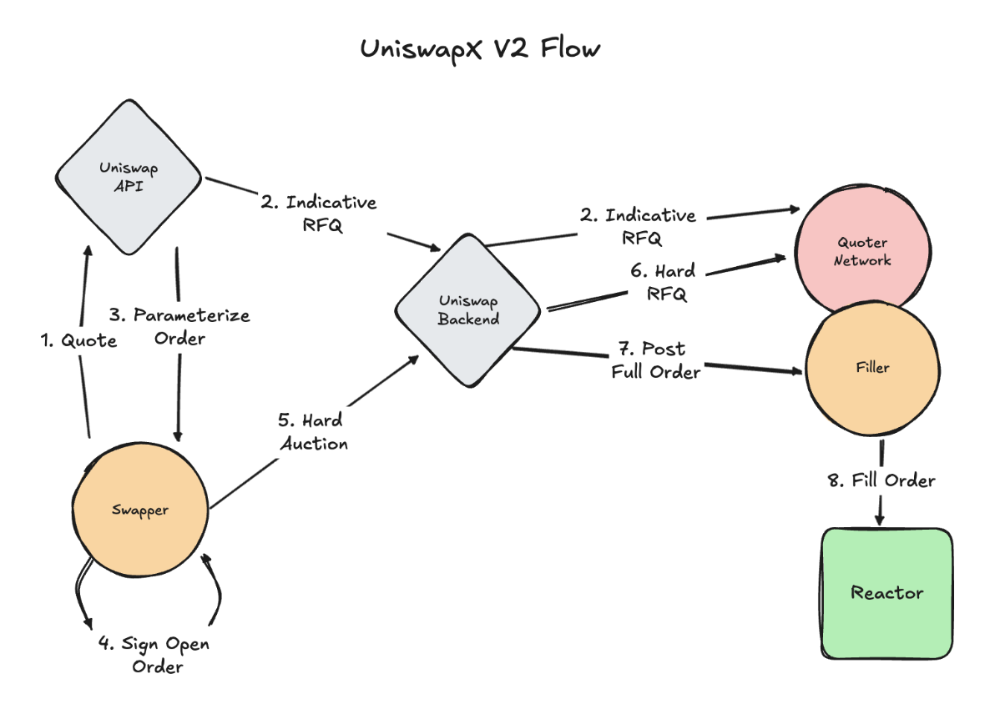
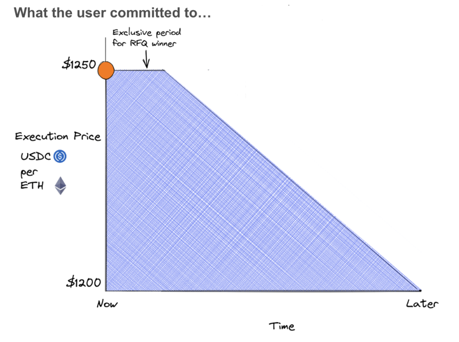
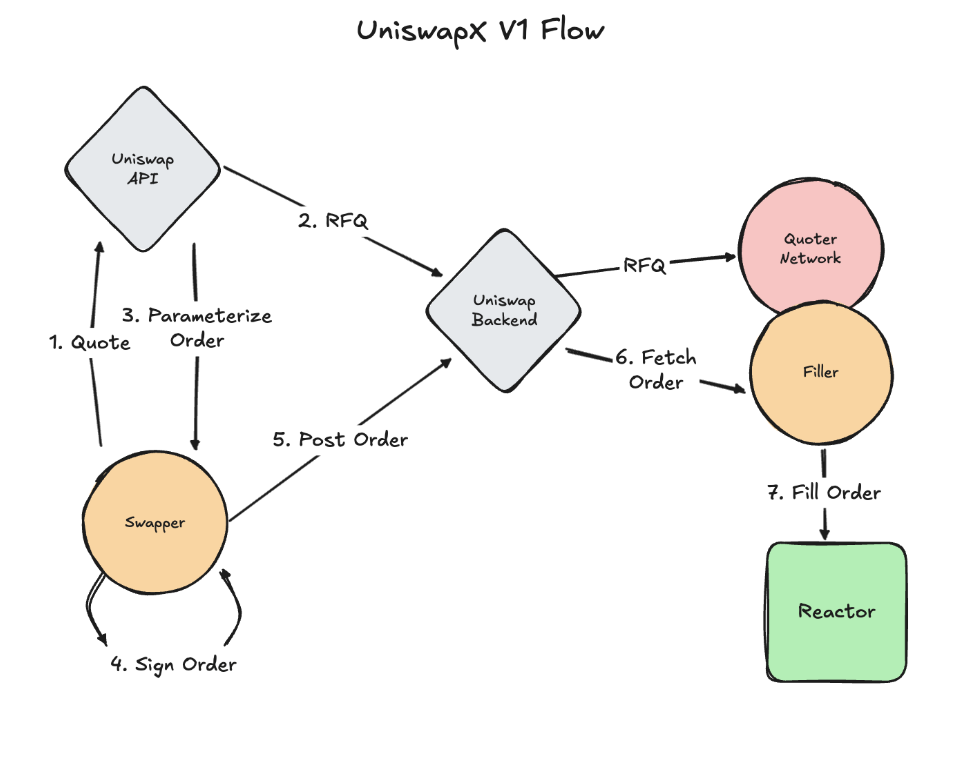

**UniswapX RFQ V2** improves quote handling by redesigning order quote flow to reduce quoter gaming. It minimizes the time between quote submission and required fill, targeting high fill rates and making Ethereum mainnet trading more efficient and reliable.

To achieve this, the quoting flow is divided into two phases:

1. **Indicative Quotes**: Provided pre-signature when the swapper is exploring quotes but has not committed to trading. Quoters can participate here without being held fully accountable.
2. **Hard Quotes**: Provided post-signature when the swapper has committed to trading. Quoters are held fully accountable for these quotes.

Since hard quotes are provided post-signature, they are instantly executable by fillers removing the risk of market movements causing the order to fail.

To prevent gaming, quoters cannot distinguish between indicative and hard quotes. As a result, they must always assume all quotes are hard and provide competitive prices.

<Callout type="info" title="Current Status">
UniswapX RFQ V2 is the default version running on Ethereum mainnet across Uniswap interfaces.
</Callout>

## V2 Flow

<Callout type="info" title="Source Code">
See the [`V2DutchOrderReactor`](https://github.com/Uniswap/UniswapX/blob/main/src/reactors/V2DutchOrderReactor.sol) for the smart contract implementation.
</Callout>

1. The user requests a quote from the interface.  
2. The Uniswap Backend (URA) runs an indicative RFQ auction, soliciting quotes for the best price. (**Note:** Quoters do not know whether the RFQ is indicative or hard, forcing them to always provide competitive prices.)
3. The quotes from the RFQ process parameterize an [initial quote](https://github.com/Uniswap/UniswapX/blob/33fa564cfaa6d58f6e3fcf7e7988cb5fc1c61de7/src/lib/V2DutchOrderLib.sol#L31) order shown to the user.  
4. The user signs the order and submits it.  
5. The Uniswap Backend (GPA) runs a second "hard" RFQ process, soliciting new quotes.  
6. Quoters return updated prices.  
   * If the price is within or improves on the user’s signed parameters, it is finalized and added to the order’s [CosignerData](https://github.com/Uniswap/UniswapX/blob/33fa564cfaa6d58f6e3fcf7e7988cb5fc1c61de7/src/lib/V2DutchOrderLib.sol#L20).  
   * If the price moves outside the signed parameters, the order fails, and the user must try again.  
7. The finalized order containing CosignerData is posted to the filler network for execution.  
8. The winning filler executes the order.

## Why Is a Cosigner Needed?

In UniswapX RFQ, users commit to a range of prices when signing their order. Without safeguards, a malicious auctioneer could provide users the worst price within their range.

The cosigner field allows users to designate an auctioneer they trust to run the auction within signed parameters and return an executable quote. Currently, the Uniswap API sets the cosigner to Uniswap Labs, though this may be updated in the future.

## Previous Versions

In V1, the RFQ flow operated entirely pre-signature. Users requested a swap quote, which was parameterized using an RFQ quote. If they accepted the quote, they signed the order. This approach was straightforward but caused quoters in the network to be uncertain about when a quote request would convert into a signed order. This uncertainty led to occasional unfilled orders and degraded performance.

