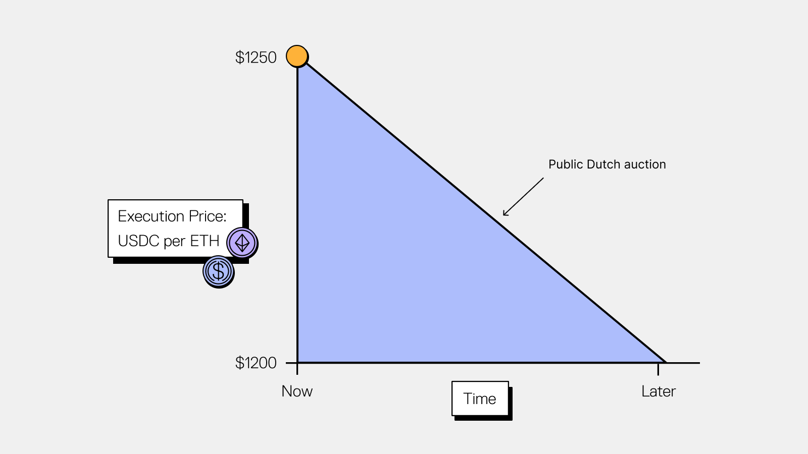

UniswapX is a permissionless, open source, auction-based swapping protocol for trading across AMMs and other liquidity sources. It supports:

- Competitive pricing through auction competition across liquidity sources
- Gas-free swapping
- Protection against MEV (Maximal Extractable Value)
- No cost for failed transactions

Swappers generate signed orders which specify the outputs of their swap, and fillers compete to satisfy these orders using their own filling strategies.

## Trading on UniswapX
To trade using UniswapX, swappers create orders that define their auction parameters and price tolerance. Each supported chain uses different auction mechanisms optimized for its specific characteristics.

For example, the graphic below illustrates a Dutch Auction, one type of auction used in UniswapX. In this auction, the order starts at a maximum price and decays down to a minimum price over time. Note that orders technically specify output token amounts, but the documentation will sometimes use 'price' interchangeably for simplicity.

Instead of submitting these orders directly onchain, swappers sign a message that uses Permit2 to allow token transfer as long as the sent and received amounts match the decay curve. These signed order messages are broadcast publicly and can be filled by anyone acting as a filler.

Once an order is broadcast, fillers compete to submit it onchain when it becomes economically viable. The realized price depends on when the first successful filler settles within the auction timeline.

## Fillers on UniswapX
Fillers are specialized participants that monitor signed orders and compete to settle them. Anyone can fill orders on UniswapX. Fillers provide their own liquidity or route through external sources to satisfy order outputs.

## Where to Go Next

- [Learn about the different auction mechanisms per chain](/docs/liquidity/uniswapx/concepts/auction-types)
- [Understand UniswapX reactors and settlement architecture](/docs/liquidity/uniswapx/concepts/architecture)
- [Find deployment addresses by chain](/docs/liquidity/uniswapx/deployments)
