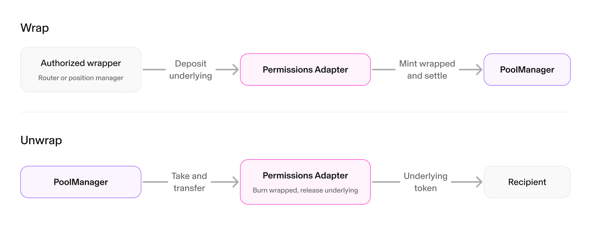
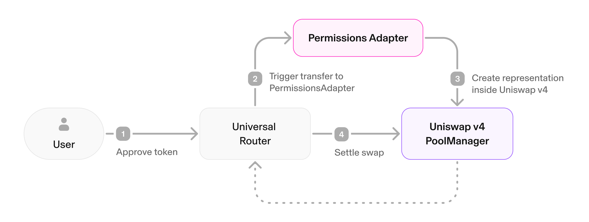

Permissioned pools are built from four contracts that work together to enforce an issuer's allowlist while keeping the permissioned token compatible with the standard `PoolManager`.

## The Permissions Adapter

The Permissions Adapter is the ERC-20 contract at the center of this design. It holds the underlying permissioned token and mints a virtual version of it that the pool trades, so the underlying token never enters the `PoolManager` directly. The adapter and the virtual token are the same contract.

Creating the virtual token and converting it back to the original are handled automatically. Swappers and liquidity providers interact with the token as usual, and the router and position manager perform these conversions behind the scenes, so end users never manage the virtual token themselves. The virtual token is necessary for two reasons:

- **The `PoolManager` allowlist cannot be enforced directly.** The `PoolManager` is a single shared contract, so it cannot be added to every issuer's allowlist. The adapter acts as the approved holder of the underlying token and keeps the raw asset out of the `PoolManager`.
- **Direct holding would expose the token as a freely tradable claim.** A permissioned token held directly by the `PoolManager` could be minted into an ERC-6909 claim and traded without the allowlist. The adapter prevents this by restricting minting to authorized periphery contracts, such as the position manager, router, and quoters the issuer approves.

See the [`PermissionsAdapter` source](https://github.com/Uniswap/v4-periphery/blob/main/src/hooks/permissionedPools/PermissionsAdapter.sol) in `v4-periphery`.

- **Pool manager exclusivity:** only the `PoolManager` can hold the virtual token. When it is transferred out of the pool, the adapter burns it and releases the underlying token in the same call.
- **Pluggable allowlist:** the adapter delegates permission checks to an allowlist checker that the issuer implements and deploys.

The adapter exposes several administrative functions for the permissioned token issuer:

- **`updateAllowListChecker`:** update the pluggable validation contract that decides who is authorized to swap the token or provide liquidity.
- **`updateAllowedWrapper`:** approve or revoke a contract, such as a router, position manager, or quoter, that can create a virtual version of the token.
- **`updateSwappingEnabled`:** enable, pause, or resume swapping for the token. Swapping is disabled by default on a new adapter.
- **`updateAllowedHook`:** allow or revoke a hook for the adapter. Position mints and liquidity increases revert with `InvalidHook` unless the pool's hook is allowed. The position manager and the router both read this from the adapter, so one call covers every periphery contract.

## Permissioned Hooks

The permissioned hook enforces the allowlist on every interaction. Like any v4 hook, it is attached to a pool at initialization through the `PoolKey`. It activates four callbacks:

- `beforeInitialize` queries the `PermissionsAdapterFactory`, requires at least one pool currency to be a factory-verified adapter, and rejects any currency that is an unverified adapter, so a pool cannot be created around an unverified Permissions Adapter.
- `beforeSwap` checks the `SWAP_ALLOWED` flag for the swapper, and also reverts while the issuer has swapping paused via `updateSwappingEnabled`.
- `afterSwap` emits a `Swap` event so indexers can track activity on permissioned pools.
- `beforeAddLiquidity` checks the `LIQUIDITY_ALLOWED` flag before a position is minted.

Permissions are expressed as flags: `SWAP_ALLOWED` (`0x0001`) and `LIQUIDITY_ALLOWED` (`0x0002`). The hook also confirms that the calling router or position manager is approved to create virtual versions of the token (via `updateAllowedWrapper`), which is why the issuer must approve the contracts that can interact with the pool.

## Permissioned Position Manager

The Permissioned Position Manager extends the standard `PositionManager`, adding allowlist enforcement and automatic creation of the virtual token.

- **Non-transferable NFTs:** position transfers revert, which prevents an allowlisted holder from handing a position to a disallowed address.
- **Position unwinding:** the owner of either Permissions Adapter in the pool can call `unwindPosition` to burn a position NFT, remove its liquidity, and route each asset back to the holder. Any asset the holder can no longer receive falls back to that asset's own issuer (as tokens, or as an ERC-6909 claim if delivery fails), so unwinding never lets one issuer receive the other's asset.
- **Automatic conversion:** the position manager creates a virtual version of the permissioned token before interacting with the pool and validates the holder against the allowlist on mint and increase.

<Callout type="info">
When building a pool key, supply the **adapter address** as the currency, not the underlying permissioned token. The same applies when settling and taking.
</Callout>

<Callout type="info">
When a position is unwound, each asset routes to the holder first. An asset the holder can no longer receive falls back to its own issuer, never to the other issuer.
</Callout>

## Swap Routing

Swaps go through the [Universal Router](/docs/trading/swapping-api/supported-chains#universal-router-version), which converts permissioned tokens to and from their virtual versions. The router identifies the permissioned token in the swap path, creates a virtual version of it before the pool interaction, executes the swap with the virtual token, and converts back to the original token automatically on exit. The allowlist is enforced twice: by the router when it creates the virtual version of the input token, and by the hook on `beforeSwap`, so the restriction cannot be bypassed.

<Callout type="info">
Permissioned swap routing requires [Universal Router](/docs/trading/swapping-api/supported-chains#universal-router-version) 2.2.0 or higher.
</Callout>

## Adapter Verification

A factory deploys and verifies adapters. Verification confirms that an adapter is allowed to hold its underlying token: the issuer seeds the adapter with a minimal balance, as little as 1 wei, which is only possible if the adapter is on the token's allowlist. See [Step 3](/docs/protocols/uniswap-labs-hooks/permissioned-pools/deploy-a-permissioned-pool#step-3-allowlist-and-fund-the-adapter) and [Step 4](/docs/protocols/uniswap-labs-hooks/permissioned-pools/deploy-a-permissioned-pool#step-4-verify-the-adapter) for the mechanics. The factory records a mapping from each adapter to its underlying token, never the reverse.

Factory verification is separate from the ERC-165 check on the allowlist checker. Factory verification proves the adapter holds a real balance of its token, while ERC-165 only confirms that a checker implements `IAllowlistChecker`.

## Security Considerations

- **Issuer recall:** if a holder loses permissions, the Permissions Adapter owner can call `unwindPosition` to remove their liquidity and route the assets back. Assets that cannot be delivered to the holder fall back to the issuer, so an issuer can always reclaim exposure to a permissioned token when required.
- **Non-custodial design:** user funds can only leave the pool through `PoolManager` settlement flows: swaps, position withdrawals, and claim redemptions. They never leave through the virtual token directly.
- **Access control:** the Permissions Adapter owner can change the allowlist checker, approve or revoke the contracts that can create virtual tokens, and pause swapping. The owner cannot transfer positions or pull funds directly through the virtual token; unwinding routes assets to the holder first, and the issuer receives an asset only when the holder can no longer hold it. The factory and hook are shared contracts that Uniswap deploys, and they are not issuer-controlled.
- **Reverse mapping:** the factory maps each adapter to its underlying token, never the reverse, which stops anyone from registering an arbitrary allowlist check against an existing ERC-20.
- **Unwinding in dual-permissioned pools:** pools with two permissioned tokens from different issuers, for example two tokenized funds in the same sector, are fully supported. Either Permissions Adapter owner can unwind a position, and each asset routes to the holder first. An asset the holder can no longer receive falls back to its own issuer only, so one issuer cannot seize the other's asset.

## Where to Go Next

- Onboard a token in [Deploy a Permissioned Pool](/docs/protocols/uniswap-labs-hooks/permissioned-pools/deploy-a-permissioned-pool).
- Integrate permissioned tokens in an app with [Swapping through Permissioned Pools](/docs/trading/swapping-api/swapping-permissioned-pools).
- Review hook fundamentals in [Hooks](/docs/protocols/v4/concepts/hooks).
