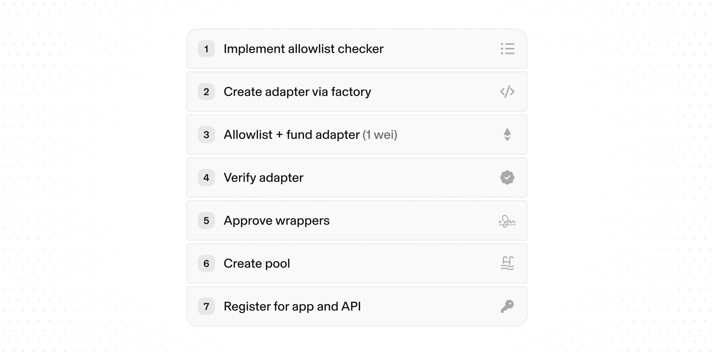

This guide walks a permissioned asset issuer through onboarding a permissioned token so it can trade in a Uniswap v4 permissioned pool. Rather than building custom infrastructure, you use the shared `PermissionsAdapterFactory` and `PermissionedHooks` that Uniswap deploys and maintains, while keeping direct administrative control over your compliance rules.

<Callout>
  You will need contract addresses throughout this guide. They are listed under [Deployment
  Addresses](#deployment-addresses) below, and on the unified [Deployments](/deployments) page and
  its [deployments.json](/deployments.json) feed. Permissioned pools use their own Universal Router
  build, so use the address listed there rather than the standard one.
</Callout>

At a high level, onboarding is seven steps:

1. **Implement an allowlist checker.** Define the compliance logic that decides who is authorized to swap or provide liquidity.
2. **Create the Permissions Adapter.** Use the factory to deploy the contract that issues the virtual version of your token and acts as its pool-facing proxy.
3. **Allowlist and fund the adapter.** Add the adapter to your token's allowlist and seed it with at least 1 wei so it can be verified.
4. **Verify the adapter.** Register it with the factory so the protocol recognizes it as a legitimate adapter.
5. **Approve virtual token contracts.** Authorize the position manager, router, and quoters that are allowed to create the virtual version of your token, and allow the permissioned hook on the adapter.
6. **Create the pool.** Initialize the pool with the adapter as a currency and the permissioned hook, then enable swapping on the adapter.
7. **Allowlist your pool for routing.** Register with Uniswap Labs so the pool is eligible for routing in the Uniswap interface and API.

The steps below walk through each in detail.



<Callout type="warn">
A permissioned pool does not by itself restrict who can hold the token. The token's allowlist does that, and the pool enforces those rules onchain for swaps and liquidity. Make sure your allowlist reflects any requirements that apply to your asset before deploying.
</Callout>

## Prerequisites

- A deployed ERC-20 permissioned token. The virtual token is always named `Uniswap v4 <name>` with symbol `v4<symbol>`, read from your token's `name()`, `symbol()`, and `decimals()`. When those are missing, it falls back to `Uniswap v4 Permissioned Token`, `v4PT`, and `18` decimals, so exposing them is recommended.
- A way to determine which addresses are allowed to swap or provide liquidity.
- The address of the `PermissionsAdapterFactory` and `PermissionedHooks` for your target network. See [Deployment Addresses](#deployment-addresses).

Developing with Uniswap v4 _requires [foundry](https://book.getfoundry.sh)_. The permissioned pools contracts are not in a published npm release yet — the latest `@uniswap/v4-periphery` on npm predates them — so install them from source with the commit pinned:

```bash
forge install Uniswap/v4-periphery@3245c3cb99c48fa1dc2459c3b60abc37d4294aba
forge install OpenZeppelin/openzeppelin-contracts@v5.0.2
```

In the `remappings.txt`, add the following:

```
@uniswap/v4-periphery/=lib/v4-periphery/
@openzeppelin/contracts/=lib/openzeppelin-contracts/contracts/
```

`v4-periphery` has no release tags, so pinning the commit is what keeps the import paths below resolving to the code this guide describes.

## Step 1: Implement an Allowlist Checker

The adapter delegates permission checks to a contract you implement. It must satisfy the [`IAllowlistChecker`](https://github.com/Uniswap/v4-periphery/blob/3245c3cb99c48fa1dc2459c3b60abc37d4294aba/src/hooks/permissionedPools/interfaces/IAllowlistChecker.sol) interface, which is an `IERC165`. The `checkAllowlist` function returns a `PermissionFlag` for a given account and token. A single checker can therefore serve multiple assets.

```solidity
import {IAllowlistChecker} from "@uniswap/v4-periphery/src/hooks/permissionedPools/interfaces/IAllowlistChecker.sol";
import {PermissionFlag, PermissionFlags} from "@uniswap/v4-periphery/src/hooks/permissionedPools/libraries/PermissionFlags.sol";
import {ERC165, IERC165} from "@openzeppelin/contracts/utils/introspection/ERC165.sol";

contract MyAllowlistChecker is IAllowlistChecker, ERC165 {
    // Map each approved account to its granted permissions.
    mapping(address account => PermissionFlag) public permissions;

    // Return the permissions granted to `account` for `tokenAddress`.
    // PermissionFlags.SWAP_ALLOWED and PermissionFlags.LIQUIDITY_ALLOWED can be combined.
    function checkAllowlist(address account, address tokenAddress)
        external
        view
        returns (PermissionFlag)
    {
        return permissions[account];
    }

    // Owner-controlled setter to manage the allowlist (access control omitted for brevity).
    function setPermissions(address account, PermissionFlag permission) external {
        permissions[account] = permission;
    }

    // ERC-165 lets the adapter confirm this is a valid allowlist checker.
    // This is separate from factory verification of the adapter itself.
    function supportsInterface(bytes4 interfaceId)
        public
        view
        override(ERC165, IERC165)
        returns (bool)
    {
        return interfaceId == type(IAllowlistChecker).interfaceId || super.supportsInterface(interfaceId);
    }
}
```

## Step 2: Create a Permissions Adapter

Call `createPermissionsAdapter` on the factory with your permissioned token, the admin address that will own the adapter, and your allowlist checker. The factory deploys an adapter scoped to your token.

```solidity
address adapter = factory.createPermissionsAdapter(
    IERC20(permissionedToken),
    issuerAdmin,            // adapter owner: holds admin control over the pool
    IAllowlistChecker(myChecker)
);
```

<Callout type="warn">
The admin address becomes the adapter owner and holds admin control over the pool. It can change the allowlist checker, approve or revoke the contracts that can create virtual tokens, pause swapping, and unwind positions. This is a high-leverage key, so secure it accordingly, for example with a multisig.
</Callout>

## Step 3: Allowlist and Fund the Adapter

The adapter must be able to hold your permissioned token. Add the adapter address to your token's allowlist, then transfer a small balance so the factory can verify it. The amount can be as little as 1 wei.

```solidity
// 1. On your permissioned token, allow the adapter to hold the token.
// 2. Seed the adapter so it holds a non-zero balance.
PermissionsAdapter(adapter).depositForVerification(1);
```

## Step 4: Verify the Adapter

Verification confirms the adapter is allowed to hold your token. It succeeds only when the adapter holds a non-zero balance of the permissioned token.

```solidity
factory.verifyPermissionsAdapter(adapter);
```

## Step 5: Approve Virtual Token Contracts

Approve the contracts that are allowed to create the virtual version of your token and redeem the original: the Permissioned Position Manager, the Universal Router, and both quoters (`V4Quoter` and `MixedRouteQuoterV2`) used for pricing. Onchain, these are called *allowed wrappers*, which is why the function below is named `updateAllowedWrapper`. All four addresses are listed in [Deployment Addresses](#deployment-addresses) below.

```solidity
PermissionsAdapter(adapter).updateAllowedWrapper(permissionedPositionManager, true);
PermissionsAdapter(adapter).updateAllowedWrapper(universalRouter, true);
PermissionsAdapter(adapter).updateAllowedWrapper(v4Quoter, true);
PermissionsAdapter(adapter).updateAllowedWrapper(mixedRouteQuoterV2, true);
```

Then, allow `PermissionedHooks` on the adapter itself. Only the adapter owner can call this, and without it every attempt to mint a liquidity position reverts with `InvalidHook`.

```solidity
PermissionsAdapter(adapter).updateAllowedHook(IHooks(permissionedHooks), true);
```

## Step 6: Create the Pool

Create the pool with the **adapter address** as the currency and `PermissionedHooks` as the hook. The hook reverts on initialization unless at least one currency is a verified adapter.

```solidity
PoolKey memory key = PoolKey({
    currency0: Currency.wrap(adapter),   // the adapter, not the underlying token
    currency1: Currency.wrap(weth),
    fee: 3000,
    tickSpacing: 60,
    hooks: IHooks(permissionedHooks)
});
```

Finally, enable swapping on the adapter. Swapping is disabled by default on a new adapter, so swaps revert with `SwappingDisabled` until the owner turns it on.

```solidity
PermissionsAdapter(adapter).updateSwappingEnabled(true);
```

## Step 7: Allowlist Your Pool for Routing

To be eligible for routing in the Uniswap interface and API, your permissioned pool must be allowlisted with Uniswap Labs. Once your adapter is verified, [request allowlisting](/permissioned-pools-allowlist) with the details below, and the team follows up to complete onboarding.

Uniswap Labs reviews this request manually. It is not self-serve, and submitting the form does not enable routing by itself.

Allowlisting is required on every network, including mainnet and Sepolia. One request can cover several networks, so list them all in the Chain(s) field.

<Callout type="info">
This form is for issuers with a deployed, verified permissioned token. If you are still exploring and want the team to reach out, use the [Uniswap Labs Hooks interest form](/uniswap-labs-hooks) instead.
</Callout>

<Callout title="Allowlist timeline" type="info">

Requests are reviewed as they are received, but they may take varying time to consider. Submit your request as soon as your adapter is verified onchain, to give the request the most time possible before your intended launch date. Uniswap cannot guarantee that a review or an allowlisting takes place before any given launch date, but we get back to you as quickly as we can.

</Callout>

### What the form asks for

Have these ready before you open the form. Every field is required except last name and notes. You also must accept the terms and privacy notice.

- First name and last name.
- Email and Telegram handle.
- Company and company location.
- Token issuer.
- The chain or chains you want routing on.
- A CoinGecko API link for your token logo.
- Permissioned token address, verified adapter address, and KYC URL.
- Notes.

A monitored Telegram handle matters, because the team uses it to reach you with any questions about your submission. Uniswap does not work with CoinGecko to make sure logos are available and accurate, so contact CoinGecko and get your logo set before you submit this form.

During onboarding, the following values are added to the backend configuration:

- **Permissioned token address** (the token wallets hold).
- **Verified adapter address** (the Permissions Adapter created in Step 2 and verified in Step 4).
- **KYC URL** (where unapproved users complete verification).

The configuration entry looks like this:

```typescript
// Keyed by the permissioned token address, lowercased.
'0x...permissionedtokenaddress': {
  adapterTokenAddress: '0x...verifiedadapteraddress',
  kycUrl: 'https://your-kyc-provider.example/verify',
  issuer: 'Your Issuer Name',
},
```

<Callout type="info">
Addresses must be lowercase. When the adapter and the permissioned token share an address, the token already behaves as its own adapter.
</Callout>

## Deployment Addresses

The Permissions Adapter Factory, the Permissioned Position Manager, the hook, and the Universal Router are builds specific to permissioned pools, so use these addresses rather than the standard v4 equivalents. The two quoters are the standard Uniswap deployments, unchanged for permissioned pools.

### Ethereum mainnet

| Contract | Address |
| --- | --- |
| `PermissionsAdapterFactory` | 0x7DA911490Ca4663E572eA9C8154f3CdEbCE16452 |
| `PermissionedPositionManager` | 0x63Bd7e5D4EcfAA74d82AE1dE98F476C935a81973 |
| `PermissionedHooks` | 0x499a724Ab630549f14C995EC41a8E04fA3fd28c0 |
| Universal Router | 0xab863E752Bf67D8DCDD929EaAe9Be9dc83Fb3BbB |
| `V4Quoter` | 0x52F0E24D1c21C8A0cB1e5a5dD6198556BD9E1203 |
| `MixedRouteQuoterV2` | 0xE63C5F5005909E96b5aA9CE10744CCE70eC16CC3 |

### Sepolia testnet

| Contract | Address |
| --- | --- |
| `PermissionsAdapterFactory` | 0xE6B0d96919334C33d06266d1420F97f6f434fA2B |
| `PermissionedPositionManager` | 0xf99D553912084c99F6299291b75Fe9B7119Aa1A7 |
| `PermissionedHooks` | 0x51247E2291d290d17C08813A175AC86465EdE8c0 |
| Universal Router | 0x5093f1CDED83d99FfEd6602dA6260672ae16787c |
| `V4Quoter` | 0x61B3f2011A92d183C7dbaDBdA940a7555Ccf9227 |
| `MixedRouteQuoterV2` | 0x4745F77b56a0E2294426E3936dc4Fab68d9543Cd |

Swaps involving a permissioned token route through the Universal Router rather than a standalone router.

## Where to Go Next

- Understand the contracts in [Architecture](/docs/protocols/uniswap-labs-hooks/permissioned-pools/architecture).
- Add liquidity as an allowlisted LP in [Provide Liquidity](/docs/protocols/uniswap-labs-hooks/permissioned-pools/provide-liquidity).
- Integrate the token in an app with [Swapping through Permissioned Pools](/docs/trading/swapping-api/swapping-permissioned-pools).
