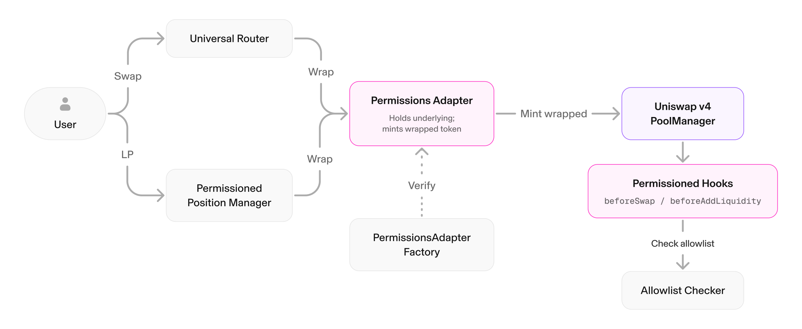

The Permissioned Pools hook lets a Uniswap v4 pool support tokens that can only be held or traded by approved addresses, such as tokenized or crypto-native assets that must restrict who can hold them. It combines an onchain allowlist with a virtual version of the token that keeps the permissioned token compatible with the standard `PoolManager`. The protocol stays permissionless: anyone can create a pool, but only allowlisted holders can swap or provide liquidity.

## Use Cases

Potential use cases for the Permissioned Pools hook include:

- **Tokenized assets** that require holders to pass identity verification before trading.
- **Regulated assets** where an issuer must be able to restrict who gains exposure.
- **Compliance-gated liquidity** where both swappers and liquidity providers must be on an allowlist.

## How It Works

With permissioned pools, a verified contract, the **Permissions Adapter**, holds the underlying permissioned token and issues a virtual version of it, and the pool trades that virtual token. When assets enter the pool, a virtual version of the token is created; when they leave, the virtual token is converted back to the original, so the holder always ends up with the underlying permissioned token. A **permissioned hook** checks the issuer's allowlist on every swap and liquidity addition, and the Permissioned Position Manager and the Universal Router handle these conversions automatically so integrations need minimal changes.

The Permissions Adapter is verified through a factory: before a pool can use it, the issuer proves the adapter is authorized to hold the underlying token by seeding it with a minimal balance, which is only possible if the adapter is on the token's allowlist. See [Architecture](/docs/protocols/uniswap-labs-hooks/permissioned-pools/architecture) for the details.

## Core Invariants

- Only allowlisted addresses can swap or provide liquidity.
- Disallowed addresses cannot gain exposure to the permissioned token, including through multi-hop routes.
- The issuer can halt swapping and can unwind liquidity positions.
- Liquidity position NFTs are non-transferable, so allowlist checks cannot be bypassed.
- The system is non-custodial: funds leave the pool only through swaps, position withdrawals, and claim redemptions, never through the virtual token directly.

<Callout type="info">
If you are considering bringing an asset onchain and want the team to follow up, [register your interest](/uniswap-labs-hooks).
If you already have a permissioned token deployed, [request allowlisting for routing](/permissioned-pools-allowlist) instead.
</Callout>

## Where to Go Next

- Learn how the contracts fit together in [Architecture](/docs/protocols/uniswap-labs-hooks/permissioned-pools/architecture).
- Onboard a token in [Deploy a Permissioned Pool](/docs/protocols/uniswap-labs-hooks/permissioned-pools/deploy-a-permissioned-pool).
- Integrate permissioned tokens in an app with [Swapping through Permissioned Pools](/docs/trading/swapping-api/swapping-permissioned-pools).
