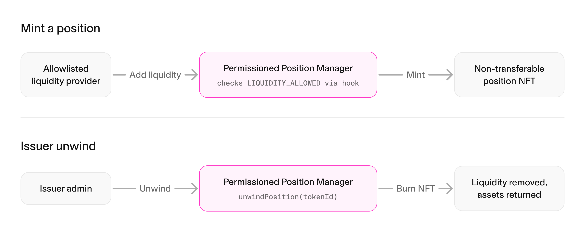

This guide walks allowlisted liquidity providers through the process of adding liquidity to a Uniswap v4 permissioned pool. It assumes familiarity with the standard Uniswap v4 liquidity provisioning flow and focuses specifically on the technical and operational differences introduced by the permissioned hook. For the deep dive into the contract details, please refer to [Architecture](/docs/protocols/uniswap-labs-hooks/permissioned-pools/architecture) first.

<Callout type="warn">
You must hold the `LIQUIDITY_ALLOWED` permission for the token. This is separate from `SWAP_ALLOWED`: a wallet allowed to swap is not automatically allowed to provide liquidity.
</Callout>

## Prerequisites

- The connected wallet is allowlisted with `LIQUIDITY_ALLOWED` for the permissioned token.
- You use the `PermissionedPositionManager`, not the standard `PositionManager`. See [Deployment Addresses](/docs/protocols/uniswap-labs-hooks/permissioned-pools/deploy-a-permissioned-pool#deployment-addresses).
- You know the token's verified **Permissions Adapter** address. The pool uses the adapter as its currency, not the underlying token.
- The `PermissionedHooks` contract is allowed on the adapter by the adapter admin through `updateAllowedHook`, part of [Step 5 of onboarding](/docs/protocols/uniswap-labs-hooks/permissioned-pools/deploy-a-permissioned-pool#step-5-approve-virtual-token-contracts). Mints and increases revert with `InvalidHook` otherwise.

## How Liquidity Differs From Standard v4

- You interact with the `PermissionedPositionManager`, which converts the token into its virtual version through the Permissions Adapter before touching the pool.
- The pool currency is the adapter address, not the underlying token.
- Minting and increasing check `LIQUIDITY_ALLOWED` twice: the position manager checks the recipient, and the hook's `beforeAddLiquidity` checks the caller.
- Position NFTs are non-transferable. `transferFrom` and `safeTransferFrom` revert with `TransferDisabled`.
- Decreasing and burning are never gated, so you can always exit, even after losing permission.
- The adapter admin can force-close your position with `unwindPosition`.

## Step 1: Approve the Position Manager

The position manager pulls the underlying token through Permit2, so approvals are on the **underlying permissioned token**, not the adapter. Approve Permit2 on the token, then approve the position manager as a Permit2 spender.

```solidity
// 1. Approve Permit2 to move the underlying permissioned token.
IERC20(permissionedToken).approve(address(permit2), type(uint256).max);

// 2. Approve the Permissioned Position Manager as a Permit2 spender.
permit2.approve(permissionedToken, address(permissionedPositionManager), type(uint160).max, type(uint48).max);
```

When the position manager settles, it pulls the underlying token into the Permissions Adapter, which creates the virtual version for the pool, so you never handle the virtual token yourself.

## Step 2: Build the Pool Key

Use the **adapter address** as the currency and `PermissionedHooks` as the hook, the same key the pool was created with.

```solidity
PoolKey memory key = PoolKey({
    currency0: Currency.wrap(adapter),   // the Permissions Adapter, not the underlying token
    currency1: Currency.wrap(weth),
    fee: 3000,
    tickSpacing: 60,
    hooks: IHooks(permissionedHooks)
});
```

## Step 3: Mint a Position

Minting uses the standard `modifyLiquidities` batch flow. Encode a `MINT_POSITION` action followed by `SETTLE_PAIR` to pay what the mint owes. The recipient must hold `LIQUIDITY_ALLOWED`, or the call reverts.

```solidity
bytes memory actions = abi.encodePacked(uint8(Actions.MINT_POSITION), uint8(Actions.SETTLE_PAIR));

bytes[] memory params = new bytes[](2);
params[0] = abi.encode(key, tickLower, tickUpper, liquidity, amount0Max, amount1Max, recipient, hookData);
params[1] = abi.encode(key.currency0, key.currency1);

PermissionedPositionManager(permissionedPositionManager).modifyLiquidities(
    abi.encode(actions, params),
    block.timestamp + 60
);
```

On settlement, the position manager pulls the underlying token from your wallet through Permit2, deposits it into the Permissions Adapter, and the adapter mints the virtual token to the `PoolManager`. The position NFT is minted to `recipient`.

## Step 4: Increase or Decrease Liquidity

Use `INCREASE_LIQUIDITY` and `DECREASE_LIQUIDITY` on the same position, exactly as on standard v4. Increases check `LIQUIDITY_ALLOWED` for the position owner. Decreases and burns are never gated, so you can always withdraw, even if the wallet later loses permission or the hook is revoked.

## Step 5: View a Position

Positions are read through the inherited `PositionManager` accessors.

```solidity
(PoolKey memory poolKey, PositionInfo info) =
    PermissionedPositionManager(permissionedPositionManager).getPoolAndPositionInfo(tokenId);

uint128 liquidity = PermissionedPositionManager(permissionedPositionManager).getPositionLiquidity(tokenId);
address owner = PermissionedPositionManager(permissionedPositionManager).ownerOf(tokenId);
```

Read raw pool state with `StateView`, the same as any v4 pool.

## Non-Transferable Positions

Position NFTs cannot be moved. `transferFrom` and both `safeTransferFrom` overloads revert with `TransferDisabled`. This prevents an allowlisted holder from handing a position to a disallowed address, which would bypass the allowlist.

## Issuer Recall

The owner of either Permissions Adapter in the pool can call `unwindPosition(tokenId)` to force-close a position. It burns the NFT, removes the liquidity, and routes each asset back to the holder. Any asset the holder can no longer receive falls back to that asset's own adapter owner (as tokens, or as an ERC-6909 claim if delivery fails), regardless of which issuer called. You can always exit a position yourself through a decrease or burn, so recall does not trap your funds.



## Where to Go Next

- Understand the contracts in [Architecture](/docs/protocols/uniswap-labs-hooks/permissioned-pools/architecture).
- Onboard a token in [Deploy a Permissioned Pool](/docs/protocols/uniswap-labs-hooks/permissioned-pools/deploy-a-permissioned-pool).
- Integrate swaps in an app with [Swapping through Permissioned Pools](/docs/trading/swapping-api/swapping-permissioned-pools).
