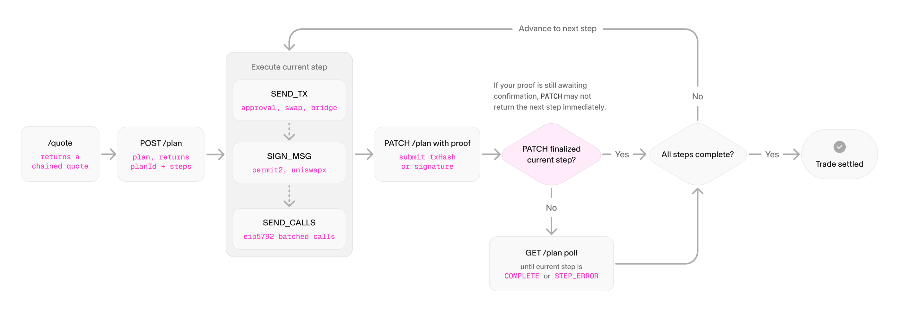

A Chained Action is a trade that the Uniswap Trading API executes as an ordered sequence of steps, such as approvals, swaps, and bridges, tracked together under a single `planId`. The API returns `"routing": "CHAINED"` from `/quote` when a trade cannot settle in one transaction, either because it crosses chains or because it needs more than one step on the same chain. You do not request chained routing explicitly. The API detects it and selects it automatically.

A few common shapes:

- `USDC (Mainnet)` to `USDT (Arbitrum)` resolves to a swap, then a bridge.
- `ETH (Mainnet)` to `USDC (Base)` resolves to a bridge, then a swap.
- `USDC (Mainnet)` to `PEPE (Base)` resolves to a swap, a bridge, and a second swap.

Without a coordinating API, an integrator would orchestrate each leg by hand: quote a swap, submit it, wait for confirmation, quote a bridge, submit it, wait again, and handle a failure at any stage. Chained Actions package that sequence into a state-tracked plan. The API handles routing and quoting. Your application handles execution and user confirmation.

To build against the plan endpoints, see the [Chained Actions Integration Guide](/docs/trading/swapping-api/chained-actions-integration).

## Execution flow

A trade becomes a Chained Action when `/quote` returns `"routing": "CHAINED"`. From there, three `/plan` endpoints drive execution: `POST /plan` creates the plan, `PATCH /plan` advances it as each step completes, and `GET /plan` reports the current state.

At a high level:

1. Call `/quote` and receive a chained quote.
2. Submit the quote to `POST /plan` to get a `planId` and the ordered steps.
3. Execute the active step, then submit proof with `PATCH /plan` to advance the plan.
4. Poll `GET /plan` until the step confirms, then move to the next step.
5. Repeat until every step completes and the trade is settled.

## Plans and steps

A plan is an ordered array of steps identified by a unique `planId`. Each step is one wallet action: an approval, a swap, a bridge, or a UniswapX order. To execute a step, you branch on its `method` and `payloadType`, covered in the [integration guide](/docs/trading/swapping-api/chained-actions-integration).

Only one step is active at any moment. The rest stay blocked until the preceding step completes. Each future step's amounts derive from the confirmed output of the step before it, so only the active step and any completed steps carry a populated payload.

## Step states

Every step moves through the same set of states:

- **`NOT_READY`**: Waiting for a preceding step to complete. Its payload is empty until the step before it confirms.
- **`AWAITING_ACTION`**: Ready to execute. Its payload is populated. Exactly one step holds this status at a time.
- **`IN_PROGRESS`**: The wallet action has been submitted and is awaiting confirmation.
- **`COMPLETE`**: Confirmed. The next step advances to `AWAITING_ACTION`.
- **`STEP_ERROR`**: Failed. Continuing requires a replan.

A step advances only after its predecessor reaches `COMPLETE`. Your application drives execution: find the `AWAITING_ACTION` step, execute it, submit proof, poll until it confirms, then move to the next.

## Routing patterns

The router automatically selects one of three patterns, based on the tokens and chains involved.

| Pattern | Condition | Example | Steps |
| --- | --- | --- | --- |
| **Swap to Bridge (S→B)** | Destination token exists on the source chain, differs from the input token, and is bridgeable | USDT (Mainnet) to USDC (Base) | `[Approval]` → Swap → Bridge |
| **Bridge to Swap (B→S)** | Source token is native ETH, and the destination token is not directly bridgeable from it | ETH (Mainnet) to USDC (Base) | Bridge → Swap |
| **Swap to Bridge to Swap (S→B→S)** | Default fallback, using ETH as the bridge medium | USDC (Mainnet) to PEPE (Base) | `[Approval]` → Swap → Bridge → Swap |

AMM swap steps can route through Uniswap v2, v3, or v4. The longest plan has three quote-generating steps, plus any approval steps on top. A plan can also end in error: see [error handling and recovery](/docs/trading/swapping-api/chained-actions-integration#error-handling-and-recovery) in the integration guide.

## Constraints

- **Exact-input behavior**: Chained Actions operate as exact-input. An `EXACT_OUTPUT` request is treated as per-leg exact-input, so do not rely on exact-output behavior.
- **Solana chain is not supported**.
- **`permitData` is always `null`** on a chained quote. Any required approval appears as an explicit step inside the plan.

## Next steps

- [Chained Actions Integration Guide](/docs/trading/swapping-api/chained-actions-integration): the full execution loop, with `cURL` examples for each step, proof submission, polling, and error recovery.
- [Swap Routing](/docs/trading/swapping-api/concepts/swap-routing): how to choose protocols and routing preferences on the underlying swaps.
