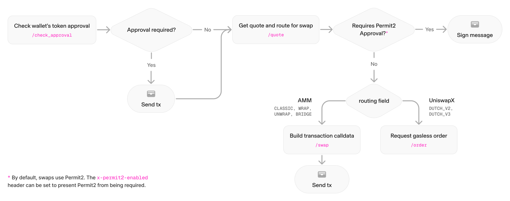

## High Level Message Flow

The diagram below is an illustration of the token swap flow where steps in gray are taken through the Uniswap API and steps in red are written to the blockchain by the integrator.

1. The integrator checks if they have given the necessary approval to the [Permit2 contract](/docs/protocols/permit2/overview) to spend the token they intended to swap through a [`/check_approval`](/docs/api-reference/check_approval) request.
   1. If the approval is not yet in place, a fully-formed transaction is returned to the integrator to sign.
2. The integrator makes a request for quote for their desired swap using a [`/quote`](/docs/api-reference/aggregator_quote) request.
   1. Quotes are requested whether the integrator is seeking to perform a token for token swap, a cross-chain bridge, or a token wrap/unwrap.
   2. The integrator specifies their desired execution paths (Uniswap protocols or UniswapX) through the `protocols` array (see more below).
   3. The integrator receives back the best available quote and a fully-formed transaction for signature to approve the the swap.
3. Depending upon the desired outcome and selected `protocols`, the integrator makes either an [`/order`](/docs/api-reference/post_order) or [`/swap`](/docs/api-reference/create_swap_transaction) API request 
   1. `/order` requests are submitted when the swap will be filled by a UniswapX RFQ market maker. In this case the order is "gasless" because the market maker will write the transaction to chain to fill the swap.
   2. `/swap` requests are submitted when the swap will be filled by a "classic" v2, v3, or v4 Uniswap protocol pool, or in the event that the swap is a bridge or a token wrap/unwrap. This is a "gasful" transaction because the integrator will write the transaction to the chain to fill the swap.

<Callout title="UniswapX Minimum Quote Values" type="info">

If using UniswapX protocols, quote requests require a minimum of 300 USDC equivalent on all supported chains. Below that, UniswapX is included only when its quote improves on the AMM route by at least 0.2%.

Requests that meet neither condition will return "No quotes available." See [Supported Chains](/docs/trading/swapping-api/supported-chains#uniswapx-chain-support) for details.

</Callout>

For full request and response schemas for each endpoint, see the [API Reference](/docs/api-reference).
