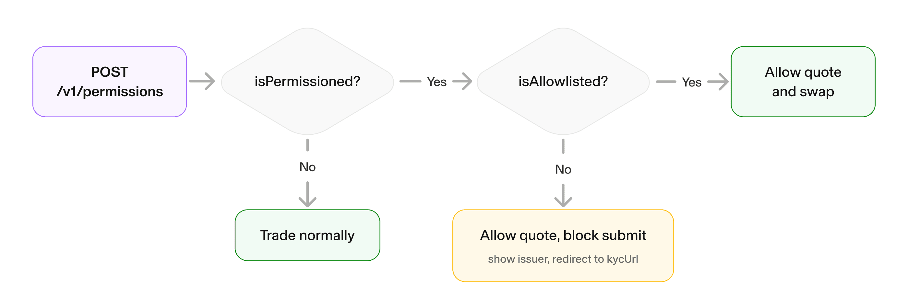

Some tokens on Uniswap v4 trade through [permissioned pools](/docs/protocols/uniswap-labs-hooks/permissioned-pools/overview), which restrict swaps and liquidity provisioning to allowlisted addresses. Before a wallet can swap one of these tokens, your app must confirm the wallet is allowlisted. The Uniswap API exposes a check permissions endpoint for this purpose. This check is a client-side safeguard for user experience: the swap endpoints reject transactions from wallets that are not allowlisted regardless, so a token never becomes tradable just because an app skips the check.

## Check Permissions Before Swapping

Send the connected wallet and the tokens it wants to trade to the check permissions endpoint. The request accepts up to two tokens.

Like every Uniswap API endpoint, `/v1/permissions` requires an API key in the `x-api-key` header. Without one it returns `401`. Create a key in the [Uniswap Developer Platform](https://developers.uniswap.org/dashboard/welcome).

```bash
curl -X POST https://trade-api.gateway.uniswap.org/v1/permissions \
  -H "x-api-key: YOUR_API_KEY" \
  -H "Content-Type: application/json" \
  -H "Accept: application/json" \
  -d '{
    "walletAddress": "0xC9bebBA9f481b12cE6f3EA54c4B182c9636ec421",
    "tokens": ["0x1111111111111111111111111111111111111111"],
    "chainId": 1
  }'
```



## Handle the Response

`isPermissioned` describes the token, meaning whether it trades through a permissioned pool. `isAllowlisted` describes the connected wallet, meaning whether that wallet may trade the token. Each token returns a result with one of three shapes:

```json
{
  "requestId": "e63f1e1e-b9e9-411a-bcc8-ff18ce4e77cf",
  "results": [
    {
      "token": "0x1111111111111111111111111111111111111111",
      "isPermissioned": true,
      "isAllowlisted": false,
      "adapterTokenAddress": "0x2222222222222222222222222222222222222222",
      "kycUrl": "https://your-kyc-provider.example/verify",
      "issuer": "Your Issuer Name"
    }
  ]
}
```

- **Not permissioned:** `isPermissioned` is `false`. No token in the request requires permission to trade, so proceed to quoting and swapping normally.
- **Permissioned and allowlisted:** `isPermissioned` and `isAllowlisted` are both `true`. Trade normally.
- **Permissioned and not allowlisted:** `isAllowlisted` is `false` and the result includes a `kycUrl`. Direct the user to complete verification. The result also includes `issuer`, the KYC provider display name, so you can tell the user who runs the verification.

## Gate Your Interface

For a wallet that is not allowlisted, let the user quote the token so they can see prices, but block transaction submission to avoid reverts and a confusing experience. Link the user to the `kycUrl` so they can complete verification.

<Callout type="info">
Check permissions before submitting. The swap endpoints reject transactions from wallets that are not allowlisted, so a pre-check avoids failed requests and wasted gas.
</Callout>

## Set the Universal Router Version

Quotes and swaps that involve a permissioned token must use [Universal Router](/docs/trading/swapping-api/supported-chains#universal-router-version) 2.2.0 or higher. Send the version header when any token in the request is permissioned.

```bash
x-universal-router-version: 2.2.0
```

## Routing Behavior

Routing will not send a user through a permissioned pool they are not allowed to trade in. Permissioned tokens are matched only as the input or output of a trade, never as an intermediate hop, so a disallowed user is never routed through a restricted token. For example, a permissioned token to USDC to ETH route is supported for an allowlisted user, while an unrelated trade routed through a permissioned token is not.

## Providing Liquidity

This page covers the swap path through the API. Liquidity provision is gated by the same allowlist: the permissioned hook checks `LIQUIDITY_ALLOWED` on `beforeAddLiquidity`, and positions are minted through the Permissioned Position Manager, which enforces the allowlist and issues non-transferable position NFTs. For the contract details, see [Permissioned Pools Architecture](/docs/protocols/uniswap-labs-hooks/permissioned-pools/architecture) and [Deploy a Permissioned Pool](/docs/protocols/uniswap-labs-hooks/permissioned-pools/deploy-a-permissioned-pool).

## Where to Go Next

- Learn how the pools work in [Permissioned Pools Architecture](/docs/protocols/uniswap-labs-hooks/permissioned-pools/architecture).
- Onboard a token in [Deploy a Permissioned Pool](/docs/protocols/uniswap-labs-hooks/permissioned-pools/deploy-a-permissioned-pool).
