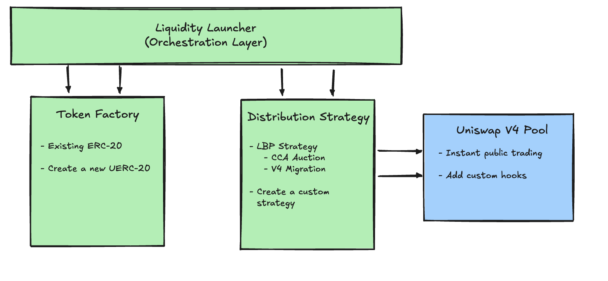

# Introduction & Overview

## What is the Uniswap Liquidity Launchpad?

The Uniswap Liquidity Launchpad is a comprehensive framework for bootstrapping initial liquidity for Uniswap V4 pools through fair, transparent price discovery (see <a href='/whitepaper_cca.pdf' target='_blank' rel='noopener noreferrer'>whitepaper</a>). It combines three critical functions into a single, composable system:

1. **Price Discovery** - Run fair auctions using a novel Continuous Clearing Auction (CCA) mechanism to establish market price
2. **Liquidity Bootstrapping** - Automatically seed Uniswap V4 pools with auction proceeds at the discovered price
3. **Token Creation** (Optional) - Deploy new ERC-20 tokens with rich metadata and optional cross-chain capabilities

Unlike traditional approaches that rely on centralized market makers or expose participants to timing games and manipulation, the Uniswap Liquidity Launchpad provides an open mechanism for boostrapping deep liquidity on decentralized exchanges.

The system is composable - it is not limited to the intial set of implementation contracts. Other auction and LBPStrategy implementations are welcome!

### Key Benefits

- **Fair Price Discovery** - Continuous clearing auctions eliminate timing games and establish credible market prices
- **Immediate Deep Liquidity** - Seamless transition from price discovery to active Uniswap V4 trading with substantial initial depth
- **Permissionless** - Anyone can bootstrap liquidity or participate in price discovery without gatekeepers
- **Transparent** - All parameters are immutable after they are set
- **Composable** - Modular architecture supports multiple auction formats and distribution strategies
- **Gas Efficient** - Optimized implementations using Permit2, multicall, and efficient data structures

## Core Components

The Uniswap Liquidity Launchpad framework is built on three coordinated components that work together to bootstrap liquidity:

1. **[Liquidity Launcher →](https://github.com/Uniswap/liquidity-launcher)** Central orchestration contract that coordinates distribution and liquidity deployment
2. **[Token Factory →](https://github.com/Uniswap/uerc20-factory)** (Optional) Creates new ERC-20 tokens with metadata, or integrates existing tokens
3. **Liquidity Strategies** - Modular contracts for different price discovery and liquidity mechanisms (prebuilt [LBP Strategy](https://github.com/Uniswap/liquidity-launcher) or [custom strategies](quickstarts/building.md))

Each component is designed to be composable and extensible, allowing you to customize your liquidity bootstrapping while maintaining security and fairness guarantees.

## High-Level Architecture



### Example Flow

The following is a high level overview of how the [LBP Strategy Basic](https://github.com/Uniswap/liquidity-launcher) contracts interface and work with the [Continuous Clearing Auction](https://github.com/Uniswap/continuous-clearing-auction/).

The following actions must be performed atomically within one transaction.

1. **Prepare Token** (Optional)

   Launch a new token using `LiquidityLauncher.createToken()` via the [UERC20Factory](https://github.com/Uniswap/liquidity-launcher/blob/96860d8239785e717cff1e4189643b9acee925ff/src/token-factories/uerc20-factory), which deploys a UERC20 or UERC20Superchain token and mints the initial supply to the launcher. Alternatively, use an existing token and approve the launcher to distribute it.

2. **Deploy Strategies**

   Call `LiquidityLauncher.distributeToken()` to deploy a new LBPStrategy instance via factory. The strategy will validate that the auction parameters and eventual pool configuraiton are valid, and if so, it will deploy a CCA auction with the desired amount of tokens to sell. The `LiquidityLauncher` contract will transfer tokens to the LBPStrategy and then they will be transferred into the auction. 

   We use an optimistic transfer then call pattern throughout the contracts to trigger an action after performing an ERC20 transfer. 

3. **Auction Completion**

   When the auction ends, all of the raised funds will be swept to a specified `fundsRecipient`. The LBPStrategy will ensure that it is the recipient of both the raised funds and any leftover unsold tokens. 

   The LBPStrategy will also read the following data from the `IAuction` interface:
   ```solidity
   interface IContinuousClearingAuction {
      function currencyRaised() external view returns (uint256);
      function clearingPrice() external view returns (uint256);
   }
   ```

4. **Seeding Liquidity**

   Anyone can call the `migrate()` function on the `LBPStrategy` after the configured `migrationBlock`. This does the following:
   - Initialize a new Uniswap V4 pool at the price from the auction
   - Deploy a full-range LP position using the auction proceeds + reserve tokens
   - (Optionally) deploy a one-sided position with remaining tokens
   - Mint the LP NFT to the a specified `positionRecipient`
   - Sweep any leftover tokens or raised funds to a configured `operator` 

5. **After Migration**

   The pool will be live on Uniswap V4 with deep liquidity around the discovered price. Participants in the auction can claim their purchased tokens on the auction after `claimBlock`, and these instances of the LBPStrategy + Auction contracts should hold no funds after all bids are withdrawn and all actions performed.

## Next Steps

- Learn about the [Continous Clearing Auction](./05-auction-mechanism.md) mechanism
- Read the <a href='/whitepaper_cca.pdf' target='_blank' rel='noopener noreferrer'>whitepaper</a> to learn more about the mechanism
