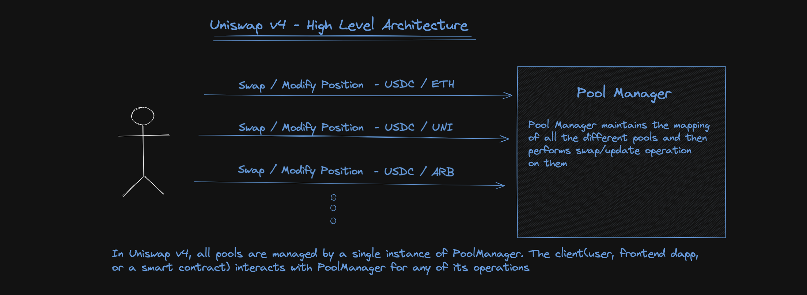
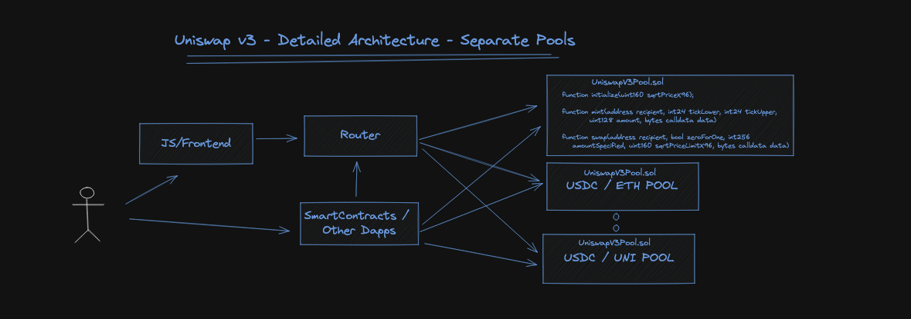

# Architecture
In Uniswap V3, each pool has its own contract instance, which makes initializing pools and performing swaps in multiple pools costly.
Whereas, in V4, all pools are kept in a single contract to provide substantial gas savings.

Early calculations say that V4 will
make the gas cost of creating pools 99% less. Hooks offer unlimited choices and the single contract lets you easily
move through all these choices.

This Singleton design is improved by a new "flash accounting" method. Instead of moving assets in and out of pools
after each swap in V3, this method only moves the net balances. This means the system is a lot more efficient and
saves even more gas in Uniswap V4.

Because of the efficiency of the Singleton contract and flash accounting, there is no need to limit fee tiers. People
who create pools can choose them to be most competitive or change them with a dynamic fee hook. V4 also supports
native ETH again, which helps save more gas.
