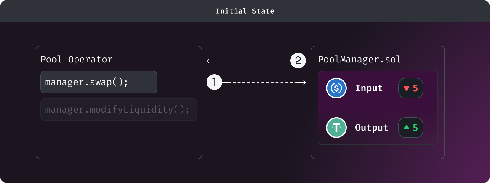
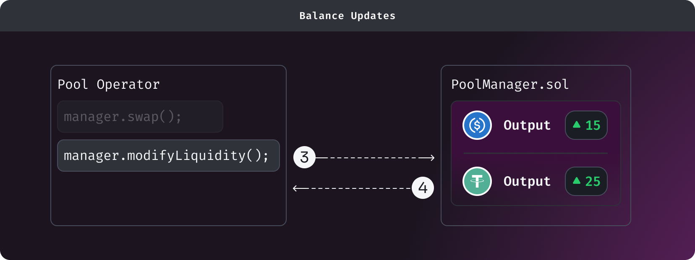
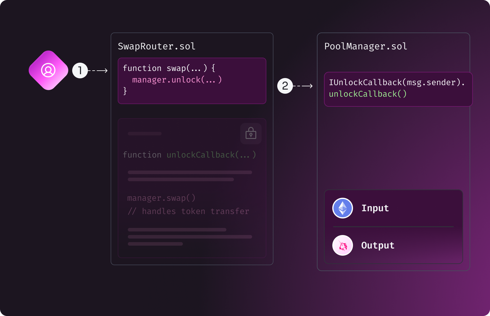
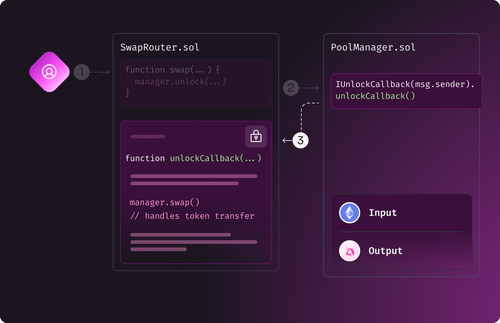
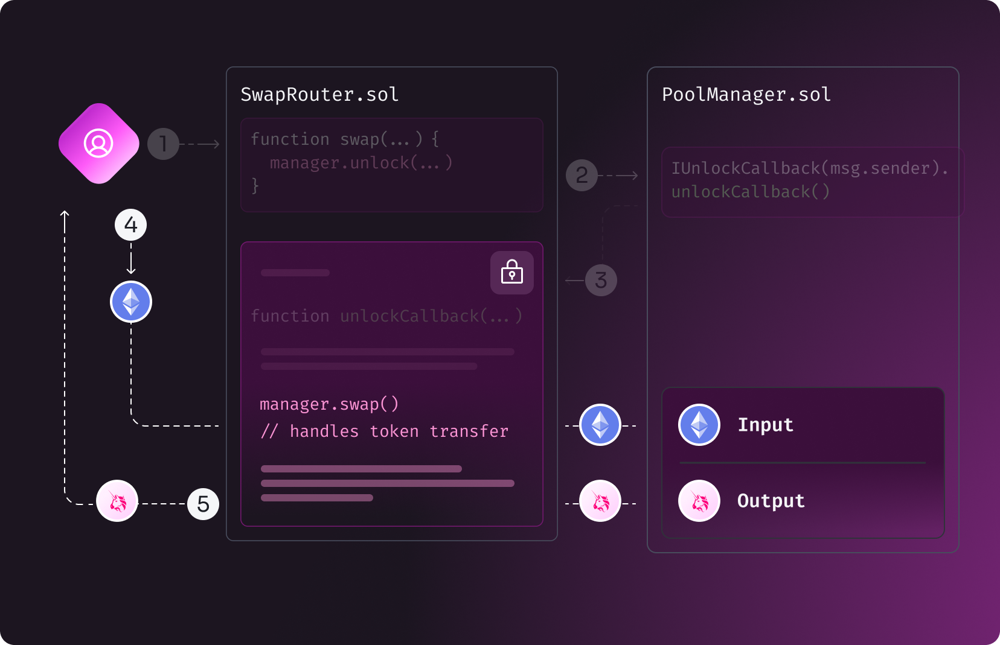
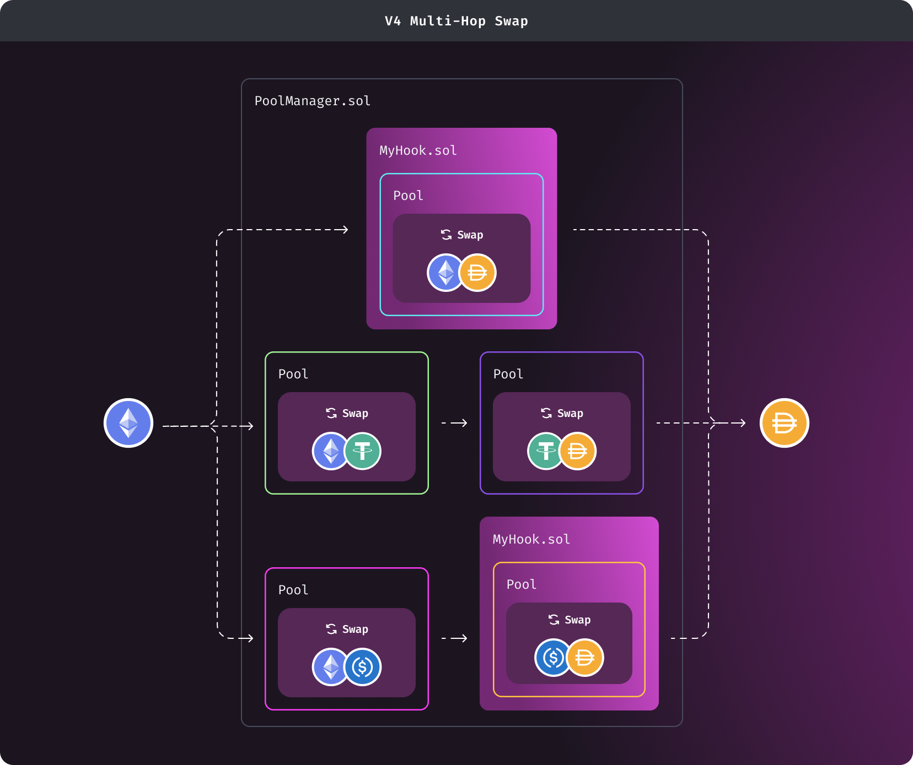

# Flash Accounting

In previous versions of Uniswap, every time a swap was made - including multi-hop swap - tokens were transferred between Pool contracts for intermediate steps.

This design incurred inefficiencies because transferring tokens with external calls to their smart contracts - especially in a multi-hop swap - is quite expensive. This design was required since each pool was its own contract and token transfers were required to maintain accounting and solvency.

With the singleton architecture, a better design was possible and is referred to as _Flash Accounting_. The design became practical with gas efficiencies of [Transient Storage](https://eips.ethereum.org/EIPS/eip-1153). _Flash Accounting_ further reduces the gas cost of trades that cross multiple pools and supports more complex integrations with Uniswap v4.

With _flash accounting_, each balance-changing operation (e.g. swap and liquidity modification) updates an internal net balance known as `delta`. Only the final balance-changes require token transfers.

For example from the above diagrams - let's say you have 20 `USDC` and 20 `USDT` but you want to add liquidity with 15 `USDC` and 25 `USDT`. Previously this would require multiple external calls as tokens were transferred between Pool contracts when swapping from `USDC` to `USDT`. But now with v4's Flash Accounting we only need to keep track of `delta` - thus we can `swap` and `modifyLiquidity` in a single call and only the final balance-changes involve actual token transfers.

In the above example, we are swapping 5 USDC to 5 USDT to create liquidity with 15 USDC and 25 USDT. In between the operations (*swap, modifyLiquidity*), no token transfers are made

## Mechanism

### Locking

To ensure correctness and atomicity in complex operations like a multi-hop swap - v4 uses a locking mechanism. Anytime key actions need to take place within the `PoolManager` - e.g. swaps and liquidity modification - a periphery contract must `unlock` the `PoolManager` first. Then integrators implement the `unlockCallback` and proceed with any of the following actions on the pools:

- swap
- modifyLiquidity
- donate
- take
- settle
- mint
- burn
- sync

*Note that pool initialization can happen outside the context of unlocking the `PoolManager`, as there are no balance-changing operations associated with pool creation.*

The following diagrams visualize how the above steps will be implemented:

1. `unlock` the `PoolManager`

2. Implement `unlockCallback` and proceed with any desired pool actions

3. The actual token transfer happens at the end and the *delta* should be resolved

### Balance Delta

Inside `unlockCallback`, a periphery contract performs balance-changing operations i.e. conduct swaps, modify positions, etc. After returning execution context back to `PoolManager`, the core contract checks that balances are resolved - nothing is owed to or from the `PoolManager`.

The balances resolved above is what we refer as the `delta`, a field held in the _transient_ state. The value(s) represent the _debts_ and _credits_ of assets owed to or from the `PoolManager`.

## Swapping

As shown in the above diagram, for example - let's say you want to swap `ETH` for `DAI`. Assuming this requires a multi-hop swap going from `ETH` to `USDC` and then from `USDC` to `DAI`.

### Previously on v3

1. `ETH` is transferred to `ETH <> USDC` pool contract

2. `USDC` is withdrawn from `ETH <> USDC` contract and transferred to `USDC <> DAI` contract

3. `DAI` is withdrawn from `USDC <> DAI` contract and transferred to the user

### Now on v4

1. Call `swap()` on `ETH <> USDC`

2. Call `swap()` on `USDC <> DAI`, with the credit of USDC from above being used as the input amount

3. User _resolves deltas_ by paying ETH and receiving DAI

Therefore we can skip the step of actually calling `transfer()` on the USDC contract.

The optimization scales infinitely, any number of arbitrary hops only requires two token transfers - input and output tokens.

## Liquidity Management

The optimization becomes more evident for complex liquidity operations

For example, a user wanted to add liquidity to `ETH <> DAI` but does not have DAI. The user can swap some `ETH` to `DAI` in order to add liquidity with both tokens. In addition, the user can multi-hop swap going from `ETH` to `USDC` to `DAI`. If properly integrated, the user would only need to transfer ETH _once_.

## Developer resources

To see how unlock callback and delta work in a smart contract read [Unlock Callback & Deltas](/contracts/v4/guides/unlock-callback).
