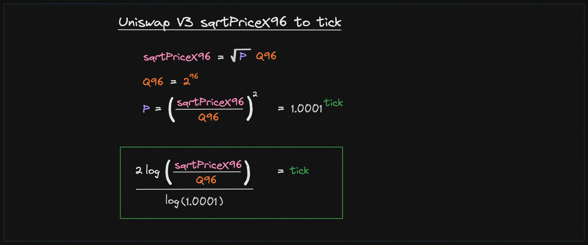

# Position
To add or remove the tokens we call the function `modifyPosition` which is defined in `PoolManager.sol` file

```solidity
struct ModifyPositionParams {
   // the lower and upper tick of the position
   int24 tickLower;
   int24 tickUpper;
   // how to modify the liquidity
   int256 liquidityDelta;
}

/// @notice Modify the position for the given pool
function modifyPosition(PoolKey memory key, ModifyPositionParams memory params, bytes calldata hookData)
external
returns (BalanceDelta);
```

# Important Concepts
Some of the important concepts to understand when working with Uniswap V3 or V4 positions are:

1. Tick
2. Tick Spacing
3. SquareRoot Price X96
4. Liquidity Delta

### Tick
`tick` is a measure used in this code to handle prices of two different assets (tokens) in a unique way. A `tick`
represents a specific price ratio between these two assets, calculated using a mathematical formula.


There are minimum and maximum `tick` values defined within the code, ensuring that calculated prices are within a
reasonable and acceptable range.

In Uniswap V3 (and V4), liquidity providers can provide liquidity at specific price ranges (ticks), allowing them to
concentrate their liquidity and potentially earn more fees.

Each tick corresponds to a specific price, and not all prices are represented due to the discrete nature of the ticks.

### Tick Spacing
The tick spacing is a parameter that determines the separation between these usable ticks, making only every
Nth tick available for liquidity provision, where `N` is the tick spacing. This is a form of quantization of
the price levels that liquidity can be provided at.

### SquareRoot Price X96
In Uniswap V3 (and V4), the square root price (`sqrtPriceX96`) is a key concept and a crucial part of the mathematical
calculations. It's utilized for various calculations, including determining the amount of tokens that should be moved
during a swap and the liquidity calculations within specific price ranges.

Here’s a breakdown of what `sqrtPriceX96` represents:

### 1. **Square Root Price:**
The price is represented as the square root of the actual price ratio of the tokens. This representation
simplifies the math, especially when it comes to calculating the amounts to be swapped, as well as the
liquidity calculations within tick ranges.

### 2. **X96:**
The X96 suffix refers to the fixed-point format used. Uniswap V3 utilizes a 96-bit fixed-point number format.
In this representation, there is a convention to maintain high precision in calculations. The fixed-point
representation means that the actual floating-point number is multiplied by \(2^{96}\) and stored as an
integer. When reading the value, it has to be interpreted properly by dividing it by \(2^{96}\) to get the
actual value.


### SqrtPriceX96 to Tick
Since both the `tick` and `sqrtPriceX96` are representations of the price, they can be converted from one to the other.

The Uniswap V3/V4 core library provides two functions to convert between the two representations:

https://github.com/Uniswap/v4-core/blob/main/src/libraries/TickMath.sol

1. The function `getSqrtRatioAtTick` takes a `tick` value as an input, and it computes the square root of the price
ratio of the two assets at that specific `tick`. The result represents the price relationship between two
assets in a particular state or position.

2. The `getTickAtSqrtRatio` function does the reverse—it takes a square root of a price ratio and calculates
the corresponding `tick`. This `tick` value represents a position or state where the assets have the given
price relationship.



### Liquidity Delta
The `liquidityDelta` is the difference between the current liquidity and the desired liquidity in a position. It can
be positive (when you're adding liquidity) or negative (when you're removing liquidity).

Here is the code from Uniswap V3 contracts which calculates the liquidity (or liquidityDelta):

https://github.com/Uniswap/v3-periphery/blob/main/contracts/base/LiquidityManagement.sol

```solidity
   (uint160 sqrtPriceX96, , , , , , ) = pool.slot0();
   uint160 sqrtRatioAX96 = TickMath.getSqrtRatioAtTick(params.tickLower);
   uint160 sqrtRatioBX96 = TickMath.getSqrtRatioAtTick(params.tickUpper);

   liquidity = LiquidityAmounts.getLiquidityForAmounts(
       sqrtPriceX96,
       sqrtRatioAX96,
       sqrtRatioBX96,
       params.amount0Desired,
       params.amount1Desired
   );
```

# Example - Add Liquidity
Here is the code that adds liquidity to a position
```solidity
int24 tickLower = -600;
int24 tickUpper = 600;
uint256 liquidity = 1e18;

PoolManager manager = new PoolManager(500000);
// Helpers for interacting with the pool
PoolModifyPositionTest modifyPositionRouter = new PoolModifyPositionTest(IPoolManager(address(manager)));

modifyPositionRouter.modifyPosition(
    poolKey,
    IPoolManager.ModifyPositionParams({
        tickLower: tickLower,
        tickUpper: tickUpper,
        liquidityDelta: int256(liquidity)
    }),
    ZERO_BYTES
);
```
Note: `PoolModifyPositionTest` implements the `ILockCallback` interface and adds the `lockAcquired` function, which in turn calls the `manager.modifyPosition` function.

# Acquiring Lock
Full detail about the locking mechanism is explained in the [Locking Mechanism](05-lock-mechanism.mdx) section.

The contract that calls the `modifyPosition` must implement ILockCallback interface.

PoolModifyPositionTest.sol has some examples of how to acquire lock and some basic checks in place.
https://github.com/Uniswap/v4-core/blob/main/src/test/PoolModifyPositionTest.sol

In `PoolModifyPositionTest` the `lockAcquired` function is executed when the lock is acquired, handling
balance adjustments and interactions with external currencies and contracts. The function takes raw
encoded data as input, which is then decoded into structured data, specifically `CallbackData`. Essential
validations and checks are performed, ensuring the caller of the function is the manager, and it
processes the modifications such as settling amounts and making necessary transfers based on
conditions like whether the amount being positive or negative.
