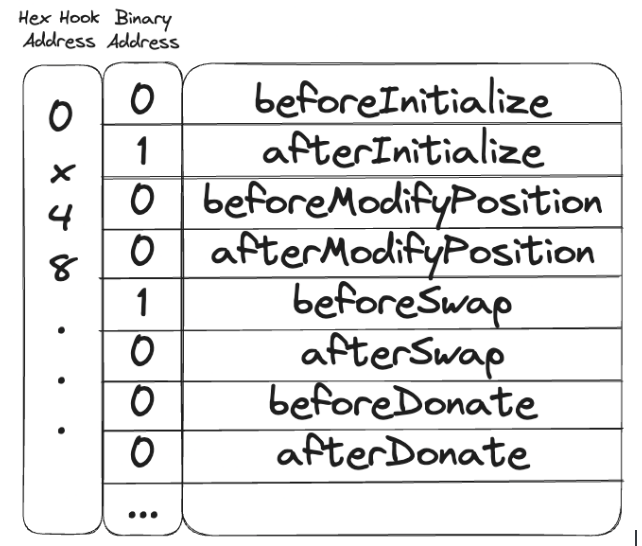

# Hook Deployment
PoolManger while initialization calls Hooks library to check if the hooks are deployed at the proper addresses

Hooks library checks the starting (or leading) bits of the hook contract's address. For instance, if a hook contract
is deployed at address 0x9000000000000000000000000000000000000000, its starting bits are '1001'. This means two
specific hooks ('before initialize' and 'after modify position') will be triggered.

```solidity
uint256 internal constant BEFORE_INITIALIZE_FLAG = 1 << 159;
uint256 internal constant AFTER_INITIALIZE_FLAG = 1 << 158;


/// @notice Utility function intended to be used in hook constructors to ensure
/// the deployed hooks address causes the intended hooks to be called
/// @param calls The hooks that are intended to be called
/// @dev calls param is memory as the function will be called from constructors
function validateHookAddress(IHooks self, Calls memory calls) internal pure {
    if (
        calls.beforeInitialize != shouldCallBeforeInitialize(self)
            || calls.afterInitialize != shouldCallAfterInitialize(self)
            || calls.beforeModifyPosition != shouldCallBeforeModifyPosition(self)
            || calls.afterModifyPosition != shouldCallAfterModifyPosition(self)
            || calls.beforeSwap != shouldCallBeforeSwap(self) || calls.afterSwap != shouldCallAfterSwap(self)
            || calls.beforeDonate != shouldCallBeforeDonate(self) || calls.afterDonate != shouldCallAfterDonate(self)
    ) {
        revert HookAddressNotValid(address(self));
    }
}

function shouldCallBeforeInitialize(IHooks self) internal pure returns (bool) {
    return uint256(uint160(address(self))) & BEFORE_INITIALIZE_FLAG != 0;
}

function shouldCallAfterInitialize(IHooks self) internal pure returns (bool) {
    return uint256(uint160(address(self))) & AFTER_INITIALIZE_FLAG != 0;
}
```

To generate valid hook addresses based on the code provided, we focus on the leading bits that indicate
which hooks are invoked. Each flag corresponds to specific leading bits in the address, as indicated by
the constants provided.

Here are some example addresses based on the flags:

1. **Just BEFORE_INITIALIZE_FLAG**
Address: `0x8000000000000000000000000000000000000000`
Leading bits: '1000...'
Hooks: 'before initialize'

3. **Just BEFORE_MODIFY_POSITION_FLAG**
Address: `0x2000000000000000000000000000000000000000`
Leading bits: '0010...'
Hooks: 'before modify position'

5. **BEFORE_INITIALIZE_FLAG and AFTER_INITIALIZE_FLAG**
Address: `0xC000000000000000000000000000000000000000`
Leading bits: '1100...'
Hooks: 'before initialize' and 'after initialize'

6. **All Flags Activated**
Address: `0xFF00000000000000000000000000000000000000`
Leading bits: '11111111...'
Hooks: 'before initialize', 'after initialize', 'before modify position', 'after modify position', 'before swap', 'after swap', 'before donate', and 'after donate'.



# CREATE2
Ethereum blockchain allows you to create contracts (think of them as mini-programs). There are two ways to create these contracts:

1. **CREATE**: This is the regular way. Every time you create a contract using this, it gets a new, unique address (like a house getting a unique postal address). You can't fully predict this address in advance.

2. **CREATE2**: This is a special way. Here, you use some ingredients (your address, a `salt` which is a unique number you choose, and the contract's code called `bytecode`) to create the contract. The magic of `CREATE2` is that if you use the same ingredients, you'll get the same contract address every time.

So, why use `CREATE2`? Because sometimes you want to know exactly where your contract will be, even before you create it. Like in your hooks system, where certain addresses trigger certain actions, using `CREATE2` helps ensure the contract is deployed to the exact right address.

Here's a small code to show how `CREATE2` works:
```solidity
bytes32 salt = keccak256(abi.encodePacked(someData));
address predictedAddress = address(uint(keccak256(abi.encodePacked(
    byte(0xff),
    deployerAddress,
    salt,
    keccak256(bytecode)
))));
```
This code predicts the address where a contract will be deployed using `CREATE2` before actually deploying it.

# Deterministic Deployment Proxy
Many developers use https://github.com/Arachnid/deterministic-deployment-proxy to deploy contracts to a specific
address. The main feature of this project is the use of the Ethereum CREATE2 opcode, which allows for deterministic
deployment of contracts. This means that using a specific set of inputs (bytecode hash and salt), the deployed
contract will always end up at the same address across different networks.

Deterministic deployment proxy uses two key techniques:
1) The proxy contract is deployed using a one-time private key, so it will always have the same address no matter when
or where it is deployed.
2) The proxy contract uses the CREATE2 opcode to deploy the target contract. CREATE2 calculates the address of the
deployed contract based on the init code and a salt parameter. By using the same init code (bytecode) and salt each
time, the target contract will be deployed to the same address across networks.

Most of the chains do have the deployment proxy at `0x4e59b44847b379578588920cA78FbF26c0B4956C`. See [here](https://github.com/Uniswap/v4-periphery/issues/59#issuecomment-1716379675)
for more details.

# Hook Deployment Code
The https://github.com/uniswapfoundation/v4-template repository contains some helper utilities for deploying hooks.

Here is the code for deploying the hooks using Deterministic Deployment Proxy which is deployed at `0x4e59b44847b379578588920cA78FbF26c0B4956C`:
```solidity
contract CounterScript is Script {
    address constant CREATE2_DEPLOYER = address(0x4e59b44847b379578588920cA78FbF26c0B4956C);
    address constant GOERLI_POOLMANAGER = address(0x3A9D48AB9751398BbFa63ad67599Bb04e4BdF98b);

    function setUp() public {}

    function run() public {
        // hook contracts must have specific flags encoded in the address
        uint160 flags = uint160(
            Hooks.BEFORE_SWAP_FLAG | Hooks.AFTER_SWAP_FLAG | Hooks.BEFORE_MODIFY_POSITION_FLAG
                | Hooks.AFTER_MODIFY_POSITION_FLAG
        );

        // Mine a salt that will produce a hook address with the correct flags
        (address hookAddress, bytes32 salt) =
            HookMiner.find(CREATE2_DEPLOYER, flags, type(Counter).creationCode, abi.encode(address(GOERLI_POOLMANAGER)));

        // Deploy the hook using CREATE2
        vm.broadcast();
        Counter counter = new Counter{salt: salt}(IPoolManager(address(GOERLI_POOLMANAGER)));
        require(address(counter) == hookAddress, "CounterScript: hook address mismatch");
    }
}
```
https://github.com/uniswapfoundation/v4-template/blob/main/script/CounterDeploy.s.sol


