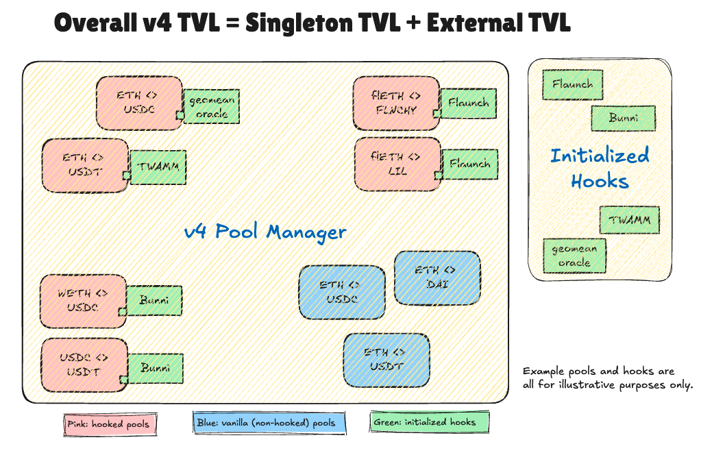
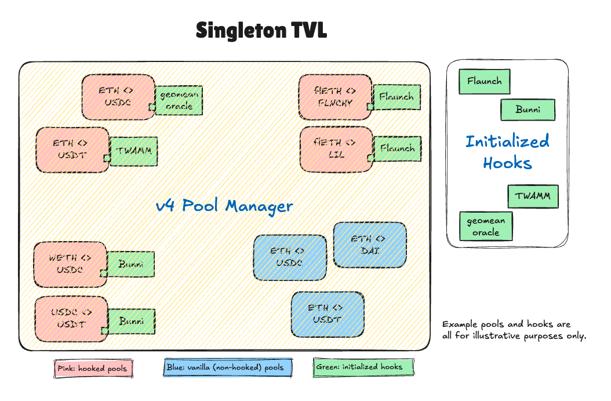
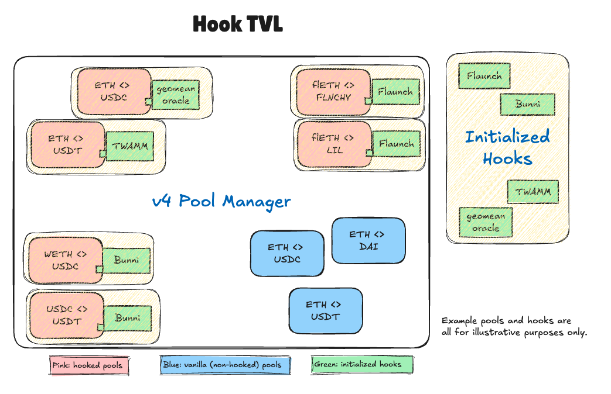
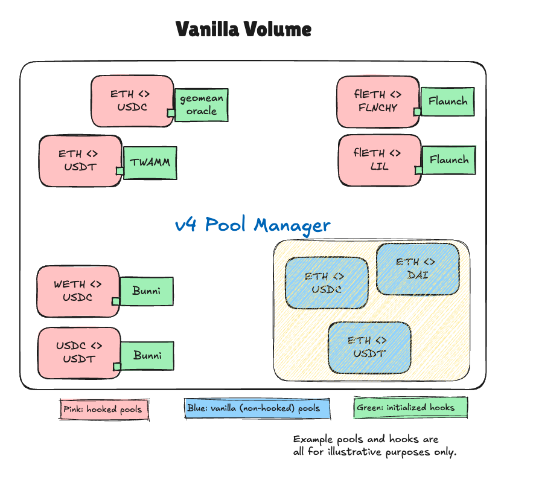
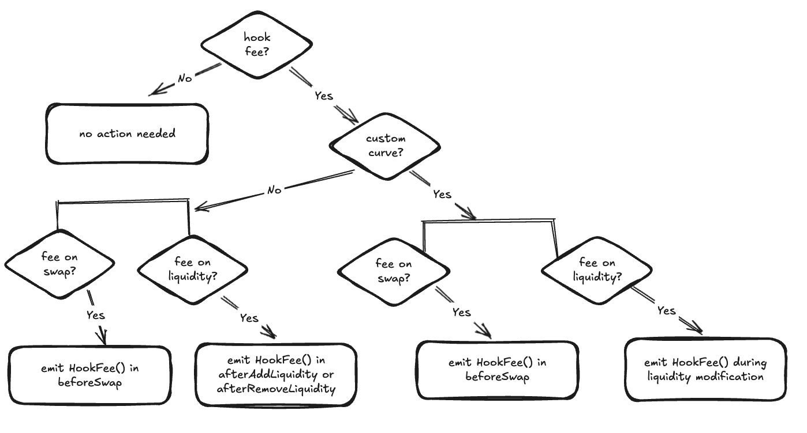
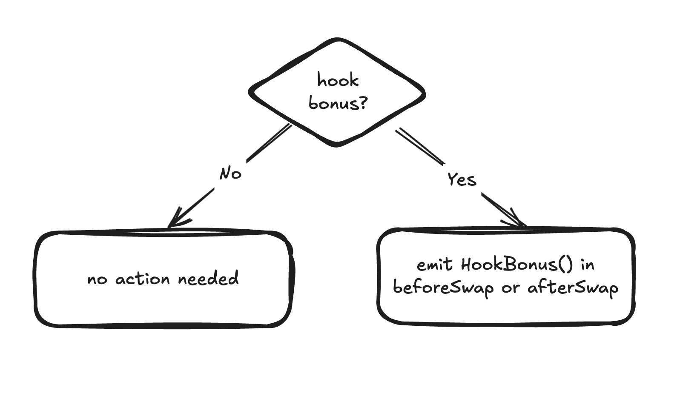

# Uniswap v4 Data Hub

Welcome to the Uniswap v4 Data Hub — your central resource for understanding Uniswap v4 metrics, hook data standards, and accessing Uniswap v4 data tools.

:::info 
Join the conversation on v4 hook data standards in our Telegram group: https://t.me/v4_hooks_data.
:::

## v4 Metric Terminology

Since Uniswap v4 introduced hooks, many traditional metrics—like total liquidity locked (TVL)—can become confusing. For instance, today, most dashboards and data platforms measure only the liquidity in the v4 singleton contract. But hooks can also hold liquidity in their own contracts (e.g., for custom curves), meaning a portion of v4’s true TVL goes uncounted.
To address this gap, we establish a shared standard naming conventions for Uniswap v4 metrics and clarifies what each metric actually measures. Our goal is to help the entire data community—from dashboard builders to indexers—share the same consistent framework and language around v4 analytics.

### TVL (Total Value Locked)

#### Overall TVL
The overall TVL in Uniswap v4 is the total value (typically in USD) of all liquidity locked in the protocol. This includes liquidity held within the singleton v4 PoolManager contract and any liquidity locked in external, initialized hook contracts. A hook contract is considered "initialized" once it is registered with at least one Uniswap v4 pool.



#### Singleton TVL
Singleton TVL refers to the portion of total liquidity held exclusively within Uniswap v4’s core (singleton) Pool Manager contract. Even if a pool is initialized with an external hook, the singleton TVL counts only the assets locked in the core contract itself, excluding any external liquidity held by hook contracts.



#### External TVL
External TVL is the total liquidity held outside the Uniswap v4 core Pool Manager contract, specifically within initialized hook contracts. A hook contract is considered "initialized" once it is registered with at least one Uniswap v4 pool.


#### Hook TVL 
Hook TVL is the total liquidity in pools that utilize hooks. It includes both regular hooked pools, where liquidity remains in the Uniswap v4 Pool Manager contract, and special hooked pools (e.g., custom curves), where liquidity resides in external hook contracts.



:::note 
**Note on Advanced Hook Scenarios**

Hooks can introduce more complex liquidity flows that extend beyond the simple “locked” model described above. For example, rehypothecation hooks may deploy liquidity into external lending protocols, where it earns yield rather than remaining in the v4 Pool Manager contract. Similarly, just-in-time (JIT) liquidity hooks may pull liquidity in from elsewhere only when needed for a swap. These scenarios mean that the “TVL” in v4 (both Singleton and External) may differ from the actual capital being utilized for swaps or residing in the protocol at any given moment.
We are actively collaborating with the broader Uniswap community and hook developers to refine our TVL definitions and measurement methods for these advanced use cases. We’ll share updates on these revised TVL standards as soon as they’re finalized.
:::

### Volume
Volume represents the total trading activity (typically in USD) on Uniswap v4, measured per trade. For example, swapping 2,673.83 USDC for 1 ETH (using the ETH price at Feb 13, 5:23 PM ET) counts as $2,673.83 in volume—not double the amount from both assets in the trade.

#### Total Volume (over a period)
Total Volume (over a period) is the cumulative trading volume across all Uniswap v4 pools within a given timeframe, including both vanilla and hooked pools.


#### Hooked Volume (over a period)
Hooked Volume (over a period) is the total trading volume in hooked pools over a given timeframe. This includes swap amounts facilitated by return delta hooks (e.g., custom curves or async swaps) that use their own custom logic and/or liquidity.


#### Vanilla Volume (over a period)
Vanilla Volume (over a period) is the total trading volume in vanilla pools — i.e. pools that are not initialized with a hook contract


:::note
You can already query holistic volume from `dex.trades` on Dune and Allium, which use trace data indexing. The Uniswap team is working to apply this to the v4 open-source subgraph.
:::

## Hook Data Standards

Although hooks can include any Solidity code, they all anchor on the [10 core hook functions](https://docs.uniswap.org/contracts/v4/concepts/hooks#core-hook-functions) in Uniswap v4. These functions correspond to key points in a pool’s lifecycle (for example, before/after a swap or liquidity modification) and provide clear “entry points” for customization. For reference, see the [Hooks.sol](https://github.com/Uniswap/v4-core/blob/main/src/libraries/Hooks.sol) contract in the Uni v4 core library and the [BaseHook.sol](https://github.com/OpenZeppelin/uniswap-hooks/blob/master/src/base/BaseHook.sol) template made by OpenZeppelin, which defines all hook entry points.

In addition to these core functions, there are 4 “delta‐returning” flags, bringing the total possible “hook flags” to 14. Each hook contract indicates which of the 14 flags it implements via the final 14 bits of its address (see our [previous v4 data guide](https://uniswapfoundation.mirror.xyz/c7LDDTWhC2ry6gp0nGqcSKHvNHosJmhPQ-ZuIxqeB2I) on how to read these bits). This allows both developers and indexers to quickly determine a hook’s properties. If you’re unfamiliar with return deltas, refer to [Custom Accounting](https://docs.uniswap.org/contracts/v4/guides/custom-accounting), [Unlock Callback & Deltas](https://docs.uniswap.org/contracts/v4/guides/unlock-callback#deltas), and [BeforeSwapDelta](https://docs.uniswap.org/contracts/v4/reference/core/types/beforeswapdelta) in the v4 doc. 


While hooks can do more than just the standard 10 core functions, these functions create a consistent foundation:
- Developers can count on known “entry points” to customize pool behavior.
- Indexers can reliably parse trace data from the same core hook calls across different hooks.

In many cases, hooks will simply modify or extend the normal v4 `PoolManager` flow and thus inherit the usual events from the Uniswap v4 core contract. However, some hooks may bypass or replace certain logic, causing the default v4 events to be skipped or rendered inaccurate. To fill that gap—and ensure accurate metrics for volume, TVL, and fees—we propose a set of hook‐specific events. By emitting them at the right times, hooks remain discoverable, analytics stay reliable, and LPs get a complete risk–reward picture.
We’re collaborating with OpenZeppelin to include these standards in the [Uniswap Hooks library](https://github.com/OpenZeppelin/uniswap-hooks/tree/master) and working with [Atrium Academy](https://x.com/atriumacademy?lang=en) to adopt them in developer training. As with any major standard (e.g., ERC20, EIP1559), broad community support is the key to success.

### Standard Hook Events

**We strongly encourage you to emit these events so that developers, LPs, analysts, and users can all share a unified framework for interpreting hook data.** By following this standard, you will also gain access to open‐source repos that we are developing, making it easy to retrieve your hook’s metrics, integrate them into front‐end displays, and leverage them for internal analytics—ensuring your hook remains visible and valuable within the broader ecosystem.

```
event HookSwap(
    bytes32 indexed id,       // v4 pool id
    address indexed sender,   // router of the swap
    int128 amount0,
    int128 amount1,
    uint128 hookLPfeeAmount0,
    uint128 hookLPfeeAmount1
);

event HookFee(
    bytes32 indexed id,       // v4 pool id
    address indexed sender,   // router of the swap
    uint128 feeAmount0,
    uint128 feeAmount1
);

event HookModifyLiquidity(
    bytes32 indexed id,       // v4 pool id
    address indexed sender,   // router address
    int128 amount0,
    int128 amount1
);

event HookBonus(
    bytes32 indexed id,       // v4 pool id
    uint128 amount0,
    uint128 amount1
);

```

### Use Case Flow Charts
The following diagrams illustrate when to emit each event during a hook’s lifecycle. Remember, these scenarios can overlap. Your hook might be both “custom curve” and “hook fee” at once, so you would emit events for both flows.

#### Custom Curve


In v4, developers can bypass the built-in v3 concentrated liquidity by using [custom accounting](https://docs.uniswap.org/contracts/v4/guides/custom-accounting), allowing them to implement their own swap curves. This enables custom liquidity provisioning and swap logic. [Custom curves](https://www.v4-by-example.org/hooks/custom-curve) are enabled through `Hooks.BEFORE_SWAP_FLAG` and `Hooks.BEFORE_SWAP_RETURNS_DELTA_FLAG`. Examples of such curves include:

- [Constant sum curve](https://github.com/saucepoint/v4-constant-sum)
- [StableSwap](https://docs.curve.fi/stableswap-exchange/overview/)
- [LAMMbert](https://github.com/euler-mab/LAMMbert/blob/main/LAMMbert.pdf)
- Asymmetric curves
- Dynamic curves
- Step-wise curve

Since these custom curves bypass the built-in `ModifyLiquidity` event emissions and produce incorrect `Swap` event information, we strongly recommend emitting `HookSwap` and `HookModifyLiquidity` events within the hook contract.


#### Async Swap


Async swaps defer swap execution to a later time, allowing hooks to control the order of swaps and protect swappers from MEV sandwich attacks. In addition, async swaps can also replace the v4 swap logic with custom curves, effectively bypassing v3-like swap implementation.

[Async swaps](https://docs.uniswap.org/contracts/v4/quickstart/hooks/async-swap) are enabled using `Hooks.BEFORE_SWAP_FLAG` and `Hooks.BEFORE_SWAP_RETURNS_DELTA_FLAG`. Due to the batch-based execution model, we recommend emitting the `HookSwap` event at the time of batch fulfillment rather than for each individual swap.

You can find an async swap template developed by OpenZeppelin [here](https://github.com/OpenZeppelin/uniswap-hooks/blob/master/src/base/BaseAsyncSwap.sol).

#### Hook Fee


Hooks can optionally charge fees on swaps or liquidity modifications, either as a fixed amount or dynamically calculated. If a hook provides a valuable service to swappers, it may choose to take fees during swaps. Similarly, hooks can impose fees on liquidity modifications. For example, a hook might penalize Just-In-Time (JIT) liquidity by charging a high fee for liquidity removal within a specific time frame. For an example of implementing a static hook fee, [check this out](https://www.v4-by-example.org/fees/fixed-hook-fee).

#### Hook Bonus


A hook bonus is the opposite of a hook fee—rather than charging swappers, hooks rebate users to incentivize swapping through pools that implement these bonus mechanisms. Hooks can achieve this using the return-delta-flags, i.e. `BEFORE_SWAP_RETURNS_DELTA_FLAG` and/or `AFTER_SWAP_RETURNS_DELTA_FLAG`.

## v4 Data Resources

### Data Guides 

- [How To Navigate Uniswap v4 Data](./guides/15-how-to-navigate-uniswap-v4-data.mdx) 
- [Establishing Hook Data Standards in Uni v4](./guides/16-establishing-hook-data-standards.mdx) 

### Data Platforms w/ Ready-Built Models
- [Dune](https://dune.com/)
- [DEX Analytics by Allium](https://dexanalytics.org/)

### Open-source v4 Indexers
- [v4 subgraph](https://github.com/Uniswap/v4-subgraph/tree/main)
- [Envio v4 indexer](https://github.com/enviodev/uniswap-v4-indexer)
- [Tycho Indexer](https://docs.propellerheads.xyz/tycho) (with v4 hooked pools support)

### Upcoming 
- OpenZepplin supporting standard v4 hook event in their [hook template](https://github.com/OpenZeppelin/uniswap-hooks/tree/master)

:::info 
Join https://t.me/v4_hooks_data to discuss v4 data! 
:::