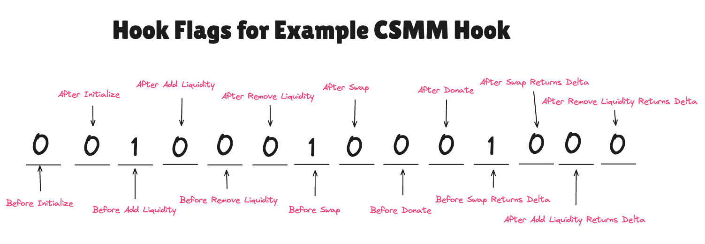

_Date: February 3, 2025_

Uniswap v4 is here! With the new singleton architecture, hooks, flash accounting, and support for native ETH, it introduces fresh concepts that change how we look at and analyze onchain data. This post provides a quick guide to help you navigate v4 data, carry out analytics, and start discovering new insights right away.

_Want to collect this guide on Mirror? [Click here to grab it](https://uniswapfoundation.mirror.xyz/c7LDDTWhC2ry6gp0nGqcSKHvNHosJmhPQ-ZuIxqeB2I)._

## Overview

- **Discover**: Where to find Uniswap v4 data and how it differs from previous versions.  
- **Learn**: Practical methods for analyzing core features—like hooks and singleton pools—to measure volume, TVL, fees, and more.  
- **Apply**: Adapt these insights to build dashboards, conduct deeper onchain research, and create new metrics tailored to v4’s innovations.

:::info 
If you have questions about methodology or want to help shape standards for v4 data, join our Telegram group: https://t.me/v4_hooks_data.
:::

## How Is v4 Different?

Uniswap has come a long way since v1’s constant product AMM design, where you could only swap ETH and a single ERC20. v2 brought token-to-token swaps and flash swaps, expanding use cases and liquidity opportunities. Then v3 introduced concentrated liquidity and multiple fee tiers, boosting capital efficiency for LPs and improving execution for traders.

Now, v4 retains those v3 benefits but layers on new features such as a singleton architecture and hooks, enabling more efficient and creative AMM expression. These innovations also complicate the data landscape:

- **Singleton [PoolManager](https://docs.uniswap.org/contracts/v4/reference/core/PoolManager)** replaces factory-created pool contracts, changing how we track pool creation and liquidity events.
- **Hooks** can override swap amounts, fees, and liquidity behavior—making the default onchain events incomplete or misleading if the hook logic isn’t factored in.

This guide aims to clarify those new complexities, showing you where to find v4 data, how to interpret it, and what to watch out for. Below, we focus on how these changes impact data collection, analysis, and ultimately, the questions you can answer with v4 onchain data.

## The Singleton Implementation and Swaps

### Pool Creation

In Uniswap v4, pools are created virtually within the `PoolManager` contract and identified by an `id`. This differs from previous versions, where a factory contract created pools with unique onchain addresses. Pool metadata, previously found in `PairCreated` or `PoolCreated` events, is now located in the `Initialize` event of the `PoolManager` contract.

**Comparison of Pool Creation Events**

| Version | Contract          | Event       | Pool Identifier | token0 / token1 Fields | Fee       | Hooks     |
|---------|-------------------|-------------|------------------|------------------------|-----------|-----------|
| v2      | [Factory](https://docs.uniswap.org/contracts/v2/reference/smart-contracts/factory)           | PairCreated | `pair`           | `token0`, `token1`     | N/A       | N/A       |
| v3      | [UniswapV3Factory](https://docs.uniswap.org/contracts/v3/reference/core/interfaces/IUniswapV3Factory)  | PoolCreated | `pool`           | `token0`, `token1`     | `fee`     | N/A       |
| v4      | [PoolManager](https://docs.uniswap.org/contracts/v4/reference/core/PoolManager)       | Initialize  | `id`             | `currency0`, `currency1` | `fee`     | `hooks`   |


### Swapping

In v4, like in v3, `amount0` and `amount1` are signed integers. But unlike v3, the sign convention in v4 is from the **user’s perspective**, not the pool’s:

- **Negative `amountX`**: user sells token X (sends it to the pool)
- **Positive `amountX`**: user buys token X (receives it from the pool)

This is opposite from v3, so be careful! If you want to skip manual sign handling, you can use standardized datasets like **DEX Trades** (on [Allium](https://docs.allium.so/historical-data/dex-trades) or [Dune](https://docs.dune.com/data-catalog/curated/evm/DEX/dex-trades)) that already account for this.

**Comparison of Swapping Events**

| Version | Contract         | Event | Pool Identifier | amount0 / amount1 Fields | Fee |
|---------|------------------|-------|------------------|---------------------------|-----|
| v2      | [Pair](https://docs.uniswap.org/contracts/v2/reference/smart-contracts/pair)             | Swap  | `pair`           | `amount0In`, `amount0Out`, `amount1In`, `amount1Out` | N/A |
| v3      | [UniswapV3Pool](https://docs.uniswap.org/contracts/v3/reference/core/UniswapV3Pool)    | Swap  | `pool`           | `amount0`, `amount1`      | N/A |
| v4      | [PoolManager](https://docs.uniswap.org/contracts/v4/reference/core/PoolManager)      | Swap  | `id`             | `amount0`, `amount1`      | `fee` |

:::note
**Note on Hooks**:  
If a pool's hook implements `beforeSwapReturnDelta` or `afterSwapReturnDelta`, the default `Swap` event may not reflect the true in/out amounts. Current implementations of `dex.trades` on Dune and Allium **does** account for these special cases by using the `swap` function call traces.
:::

## Liquidity Modification and TVL

Like v3, Uniswap v4 uses NFTs to manage LP positions, but all liquidity changes—mints, burns, etc.—now appear under a single event: `ModifyLiquidity` in the `PoolManager`.

To compute **TVL (Total Value Locked)**, you’ll need:

- Liquidity modifications (`ModifyLiquidity`)
- The current price of the pool at the time of modification

Unlike v2 or v3, direct token amounts are not always emitted. Instead, v4 logs a `liquidityDelta`, and you must do [tick math](https://blog.uniswap.org/uniswap-v3-math-primer) to compute how many tokens are locked. Here's the general approach:

1. Find the most recent price (`sqrtPriceX96`) from the nearest `Swap` or `Initialize` event  
2. Convert that price into tick space  
3. Compute token0/token1 amounts based on whether the current price is below, above, or within the LP’s tick range  
4. Convert to USD (or another reference currency) using token decimals and oracles  

Below is a high-level snippet of the logic (using Ethereum Sepolia data as an example). The full query [can be found here](https://dune.com/queries/4212828). Huge shoutout to [Grace Danco](https://x.com/_grace_lily) for putting this logic together!

> 💡 If `sqrtPriceX96` or Q notation is unfamiliar, read “A Primer on Uniswap v3 Math” (Part [1](https://blog.uniswap.org/uniswap-v3-math-primer) & [2](https://blog.uniswap.org/uniswap-v3-math-primer-2)) or just ask ChatGPT.

```sql
-- 1) Get the most recent sqrtPriceX96 before the ModifyLiquidity event
WITH get_recent_sqrtPriceX96 AS (
  SELECT *
  FROM (
    SELECT 
      ml.*,
      i.currency0 AS token0,
      i.currency1 AS token1,
      COALESCE(s.evt_block_time, i.evt_block_time) AS most_recent_time,
      COALESCE(s.sqrtPriceX96, i.sqrtPriceX96) AS sqrtPriceX96,
      ROW_NUMBER() OVER (
        PARTITION BY ml.id, ml.evt_block_time
        ORDER BY CASE WHEN s.sqrtPriceX96 IS NOT NULL 
                      THEN s.evt_block_time 
                      ELSE i.evt_block_time END DESC
      ) AS rn
    FROM uniswap_v4_sepolia.PoolManager_evt_ModifyLiquidity ml
    LEFT JOIN uniswap_v4_sepolia.PoolManager_evt_Swap s
      ON ml.evt_block_time > s.evt_block_time AND ml.id = s.id
    LEFT JOIN uniswap_v4_sepolia.PoolManager_evt_Initialize i
      ON ml.evt_block_time >= i.evt_block_time AND ml.id = i.id
  ) tbl
  WHERE rn = 1
),

-- 2) Convert sqrtPrice to ticks, handle range math
prep_for_calculations AS (
  SELECT 
    ...,
    sqrtPriceX96,
    LOG(sqrtPriceX96 / POWER(2, 96), 10) / LOG(1.0001, 10) AS tickCurrent,
    SQRT(POWER(1.0001, tickLower)) AS sqrtRatioL,
    SQRT(POWER(1.0001, tickUpper)) AS sqrtRatioU,
    ...
  FROM get_recent_sqrtPriceX96
),

-- 3) Compute how many token0/token1 are locked based on liquidityDelta
base_amounts AS (
  SELECT
    ...,
    CASE 
      WHEN sqrtPrice <= sqrtRatioL THEN liquidityDelta * ((sqrtRatioU - sqrtRatioL)/(sqrtRatioL * sqrtRatioU))
      WHEN sqrtPrice >= sqrtRatioU THEN 0
      ELSE liquidityDelta * ((sqrtRatioU - sqrtPrice)/(sqrtPrice * sqrtRatioU))
    END AS amount0,
    CASE 
      WHEN sqrtPrice <= sqrtRatioL THEN 0
      WHEN sqrtPrice >= sqrtRatioU THEN liquidityDelta * (sqrtRatioU - sqrtRatioL)
      ELSE liquidityDelta * (sqrtPrice - sqrtRatioL)
    END AS amount1,
    ...
  FROM prep_for_calculations
),

-- 4) Convert to decimals and USD
SELECT 
  ...,
  amount0 / POWER(10, tk0.decimals) * usd_price AS amount0_usd,
  amount1 / POWER(10, tk1.decimals) * usd_price AS amount1_usd,
  ...
```

## Fees

In v2 and v3, pools had predefined fee tiers (e.g., 0.3%, 0.05%). In v4, fees can be **dynamic** and adjusted by **hooks**.

Dynamic fees are signaled using a fixed constant—specifically, the 24-bit flag `100000000000000000000000`, which equals `8,388,608` in decimal. So, if you see `fee = 8388608` in an `Initialize` event, that means the pool uses **dynamic fees**.

While the `Swap` event's `fee` field always shows the **total fee** (LP + protocol), distinguishing the two requires additional logic—especially if the [protocol fee](https://docs.uniswap.org/concepts/protocol/fees#protocol-fees) switch is active.

## Hooks

[Hooks](https://docs.uniswap.org/contracts/v4/concepts/hooks) are a defining feature of v4. They enable developers to customize how pools, swap fees, and LP positions interact by implementing any subset of up to 10 hook functions. Each pool can only be linked with a single hook, but a single hook contract can serve multiple trading pools. 

### Identifying Hooked Pools

When a pool is created via the Initialize event in the PoolManager, the hooks field stores either:
- A null address, meaning no hook is attached, or
- A non-null address representing the hook contract.

Below is a quick [example query](https://dune.com/queries/4595223/7659804/) showing how many hooked pools exist on Sepolia and how many of those have dynamic fees:

```sql
SELECT 
  COUNT(*) AS total_pools,
  SUM(CASE WHEN hooks <> 0x0000000000000000000000000000000000000000 THEN 1 ELSE 0 END) AS hooked_pools,
  SUM(CASE WHEN fee = 8388608 THEN 1 ELSE 0 END) AS dynamic_fee_pools
FROM uniswap_v4_sepolia.PoolManager_evt_Initialize
```


### 14 Hook Flags

Developers can mix and match any subset of these 14 hooks. Internally, the last 2 bytes of the hook contract address encode 14 bits—one per hook function—plus 2 unused bits on the left. A bit set to 1 means that function (e.g., beforeSwap, afterAddLiquidity) is enabled.

Let's take the [CSMM](https://sepolia.etherscan.io/address/0x1ec90889c6633a0d01932fbf83be93c22d194888#code) (a constant sum market maker custom curve hook) contract as an example. If we look at the last 2 bytes of the hook address, `4888`, and convert it to 16 bits, we get `01_00100010001000`. Note that we should ignore the leftmost 2 bits. Looking at the 3rd bit onwards, we see that the 3rd, 7th, and 11th bits have a value of 1, while the rest are 0. This tells us that the corresponding hook functions —  `beforeAddLiquidity`, `beforeSwap`, and `beforeSwapReturnDelta` — are implemented.

Here is a diagram showing how each of the 14 bits correspond to a hook function.



This [example query](https://dune.com/queries/4579107/7659965/) decodes hook addresses to find enabled hook flags by extracting the last 2 bytes, converting to binary, and applying a bitwise AND:

```sql
WITH hooked_pools AS (
  SELECT 
    -- ...
    hooks
  FROM uniswap_v4_sepolia.PoolManager_evt_Initialize i
  WHERE i.hooks IN (
    0x1EC90889C6633A0d01932fbf83be93c22d194888,  -- CSMM
    0x9067ABa6C8D31113910B41e386c4Ea52bAFBC080,  -- MoonFee
    0xE9FeDDd1C31C6F4AE05F58a1094daC58A5Aa4080   -- OverrideFee
  )
),
conversion AS (
  SELECT 
    CASE 
      WHEN hooks = 0xe9feddd1c31c6f4ae05f58a1094dac58a5aa4080 THEN 'OverrideFee'
      WHEN hooks = 0x1ec90889c6633a0d01932fbf83be93c22d194888 THEN 'CSMM'
      WHEN hooks = 0x9067aba6c8d31113910b41e386c4ea52bafbc080 THEN 'MoonFee'
    END AS hook_name,
    to_base(CAST(varbinary_to_uint256(substr(hooks, -2)) AS BIGINT), 2) AS bits16
  FROM hooked_pools
)
SELECT DISTINCT
  hook_name,
  bits16,
  bitwise_and(from_base(bits16, 2), from_base('0000000010000000', 2)) != 0 AS _before_swap,
  bitwise_and(from_base(bits16, 2), from_base('0000000000001000', 2)) != 0 AS _before_swap_returns_delta,
  bitwise_and(from_base(bits16, 2), from_base('0000100000000000', 2)) != 0 AS _before_add_liquidity
FROM conversion
```


Once you identify a pool’s hook, you can explore questions like:
- Which hooked pools drive the most volume or liquidity growth?
- How do different hook configurations affect LP profitability or user swap behavior?

### How Hooks Alter Price, Fees, and Liquidity

It’s natural to ask: How do hooks actually impact swap prices, liquidity, and fees in the data? The short answer is that it depends heavily on each hook’s logic. Below are a few examples for your consideration. Separately, we will also be releasing another dedicated guide on navigating hooks data, complete with methodology and examples, in the near future.

#### MoonFee

[MoonFee](https://sepolia.etherscan.io/address/0x9067aba6c8d31113910b41e386c4ea52bafbc080#code) is a dynamic fee hook. Instead of a static fee tier set during pool initialization, it dynamically adjusts swap fees based on the moon phase. The hook implements only the `beforeSwap` function and increases swap fee when the moon is waxing to a full moon, then linearly decreases the swap fee when it’s waning to a new moon. MoonFee modifies a pool’s swap fee on the fly by calling PoolManager’s `updateDynamicLPFee`. The `Swap()` event data emitted by pools with the MoonFee hook [can be queried](https://dune.com/queries/4594903/7659347/) to see that the fee emitted changes dynamically based on the moon phase, as expected due to the dynamic adjustment of the swap fee.


#### OverrideFee

The example [OverrideFee](https://sepolia.etherscan.io/address/0xe9feddd1c31c6f4ae05f58a1094dac58a5aa4080#code) hook, similar to the MoonFee hook, dynamically changes the swap fee. However, unlike MoonFee, which uses a dynamic calculation based on the moon's phase, OverrideFee is pseudorandomly sampled and provided directly through `hookData` when a swap is initiated.

Within the OverrideFee contract, only the `beforeSwap` function is enabled, indicating that the PoolManager will exclusively call this contract before a swap occurs. During the `beforeSwap` execution, the code extracts the fee from the `hookData` provided by the entity initiating the swap via the PoolManager's `swap()` function. This user-specified fee, along with an override flag, is then returned, instructing the PoolManager to apply the new fee for the upcoming swap. Unlike MoonFee, OverrideFee’s fee value is ephemeral and not stored in PoolManager’s contract state.

This behavior can be observed in the data. [A query can show](https://dune.com/queries/4595031/7660328/) how the `beforeSwap` function is called and passed in the `hookData` containing the override fee. Subsequently, in the `Swap()` event emitted by the pools hooked with OverrideFee, the swap fee is dynamically overridden.


#### CSMM (Custom Curve)

The [Constant Sum Market Maker (CSMM)](https://sepolia.etherscan.io/address/0x1ec90889c6633a0d01932fbf83be93c22d194888#code) enforces a 1:1 token exchange ratio instead of the default x*y=k curve. It implements `beforeAddLiquidity`, `beforeSwap`, and `beforeSwapReturnDelta` hooks to customize liquidity handling and swap execution.

**How CSMM Works**

**beforeSwap**

This hook intercepts swaps and manages token input/output directly. It calculates the amount of tokens to mint and burn for a 1:1 exchange and returns the [resulting deltas](https://docs.uniswap.org/contracts/v4/reference/core/types/beforeswapdelta) (`returnDelta`) to the PoolManager for accounting. The swap direction is determined by the `zeroForOne` parameter, which indicates whether the user is swapping token0 for token1 (true) or token1 for token0 (false). Additionally, the `amountSpecified` parameter differentiates between ExactInput and ExactOutput swaps: a negative value indicates an ExactInput swap where the user specifies the input amount, while a positive value signifies an ExactOutput swap where the user specifies the output amount. The returned `returnDelta` is used to settle token balances based on the swap direction and input/output style.

The formula below, written in ternary notation, determines `amount0` and `amount1`. The final result is multiplied by -1 to align with v4's `Swap()` event convention. This is necessary because the logic is initially described from the pool's perspective, whereas `amount0` and `amount1` should be calculated from the user's perspective.

```
amount0 = -1 * (zeroForOne and exact-input) ? specifiedDelta : unspecifiedDelta
amount1 = -1 * (oneForZero and exact-input) ? specifiedDelta : unspecifiedDelta
```

**Liquidity Handling**

Standard Uniswap v4 liquidity additions are blocked by the `beforeAddLiquidity` hook. Instead, CSMM requires equal amounts of tokens to be deposited via its custom `addLiquidity` function, with liquidity tracked in the hook’s internal balances rather than the usual PoolManager logs. This means the liquidity (or TVL) will sit within the hook's contract, rather than within the PoolManager contract.

**Data Implications**

The `amount0` and `amount1` fields in `Swap()` events may be zero or misleading because the hook overrides swap logic. Instead, the actual swap amounts must be derived from `returnDelta` and swap parameters. To decode swaps involving CSMM, you need to:
- Extract `returnDelta` from the `beforeSwap` call.
- Split the int256 value into two signed 128-bit integers:
  - Top 128 bits: `specifiedDelta`
  - Bottom 128 bits: `unspecifiedDelta`
- Determine `amount0` and `amount1` using `zeroForOne` and `exactInput`

Note that we can extract the `zeroForOne`, `amountSpecified` fields from the `SwapParams` field passed in while `beforeSwap()` is invoked.

Here is an [example query](https://dune.com/queries/4594829/7659159/) demonstrating how we can decode returnDelta for CSMM swaps, with detailed inline comments. 

```sql
-- Get Swap interactions with CSMM (constant product market maker) hook

with selected_pools as (
    select id as pool_id -- 28
    ...
    from uniswap_v4_sepolia.PoolManager_evt_Initialize
    where hooks = 0x1EC90889C6633A0d01932fbf83be93c22d194888 -- CSMM
)

, fixed_bytes as (
    select s.evt_block_time 
        ...
        , b.output_1 as returnDelta 
        , CAST(
            json_extract(params, '$.zeroForOne') AS boolean
        ) AS zeroForOne
        , json_extract(params, '$.amountSpecified') as amountSpecified
        , CAST(b.output_1 AS varbinary) AS int256_varbinary
    from uniswap_v4_sepolia.PoolManager_evt_Swap s
    left join uniswap_v4_hooks_sepolia.CSMM_call_beforeSwap b on b.call_success
    ...
)

, wrangled as (
    select *
        -- 1) Check sign bit in the "top 128 bits" first byte 
        , CASE 
            WHEN bitwise_and(
                varbinary_to_bigint(varbinary_substring(int256_varbinary, 1, 1)),
                from_base('80', 16)  -- 0x80 as decimal 128
            ) = from_base('80', 16)
            THEN varbinary_to_int256(
                varbinary_concat(
                    from_hex('0xFFFFFFFFFFFFFFFFFFFFFFFFFFFFFFFF'), -- 16 bytes of 0xFF
                    varbinary_substring(int256_varbinary, 1, 16)           -- the top 16 bytes
                )
            )
            ELSE varbinary_to_int256(
                varbinary_concat(
                    from_hex('0x00000000000000000000000000000000'), -- 16 bytes of 0x00
                    varbinary_substring(int256_varbinary, 1, 16)
                )
            )
        END AS high_bits

        -- 2) Check sign bit in the "bottom 128 bits" first byte
        , CASE
            WHEN bitwise_and(
                varbinary_to_bigint(varbinary_substring(int256_varbinary, 17, 1)),
                from_base('80', 16)
            ) = from_base('80', 16)
            THEN varbinary_to_int256(
                varbinary_concat(
                    from_hex('0xFFFFFFFFFFFFFFFFFFFFFFFFFFFFFFFF'), -- 16 bytes of 0xFF
                    varbinary_substring(int256_varbinary, 17, 16)          -- the bottom 16 bytes
                )
            )
            ELSE varbinary_to_int256(
                varbinary_concat(
                    from_hex('0x00000000000000000000000000000000'), -- 16 bytes of 0x00
                    varbinary_substring(int256_varbinary, 17, 16)
                )
            )
        END AS low_bits
        
    from fixed_bytes order by 1 desc
)

, base_data as (
    select 
        evt_tx_hash
        , swap_fee_pct
        , cast(cast(amountSpecified as varchar) as int256) / 1e18 as amountSpecified_input
        
        , zeroForOne
        -- // bool exactInput = params.amountSpecified < 0
        , CASE WHEN cast(cast(amountSpecified as varchar) as int256) < 0 THEN TRUE ELSE FALSE END AS exactInput
        , high_bits / 1e18 as specifiedCurrency
        , low_bits / 1e18 as unspecifiedCurrency
    from wrangled
)

/*
Formula for calculating amount0 and amount1 from returned delta
    amount0 = (zeroForOne and exact-input) ? specifiedDelta : unspecifiedDelta
    amount1 = (oneForZero and exact-input) ? specifiedDelta : unspecifiedDelta
*/
SELECT 
    evt_tx_hash
    , swap_fee_pct
    , amountSpecified_input 
    , zeroForOne
    , exactInput
    , specifiedCurrency as specifiedDelta
    , unspecifiedCurrency as unspecifiedDelta

    -- Calculate amount0 and amount1 with formula
    -- Since the code is written from the pool's perspective, following v4 convention on amount0 amount1
    -- They should be from the user's perspective, hence flipping the sign by muliplying with -1
    , -1 * CASE 
        WHEN zeroForOne AND exactInput THEN specifiedCurrency
        ELSE unspecifiedCurrency
    END AS amount0
    , -1 * CASE 
        WHEN NOT (zeroForOne AND exactInput) THEN specifiedCurrency
        ELSE unspecifiedCurrency
    END AS amount1
FROM base_data

```

### On Return Delta

The introduction of hooks with 14 customizable flags opens up unprecedented possibilities for innovation in the AMM space but also introduces non-standard cases for onchain data. As seen in the CSMM example, hooks implementing custom swap functions override `amount0` and `amount1` values emitted in the `Swap` event. Instead, the actual swap amounts must be derived from the `returnDelta` of the `beforeSwap()` function. This means that for accurate volume calculations in Uniswap v4, the `Swap` event alone is no longer sufficient—when `BeforeSwapReturnDelta` or `AfterSwapReturnDelta` flags are enabled, monitoring the `returnDelta` values is essential.

Similarly, flags like `AfterAddLiquidityReturnDelta` and `AfterRemoveLiquidityReturnDelta` require tracking `returnDelta` from the corresponding `afterAddLiquidity()` and `afterRemoveLiquidity()` hooks to correctly observe liquidity changes. Additionally, hooks such as `beforeAddLiquidity` can block standard liquidity additions, making the `ModifyLiquidity` event from the PoolManager incomplete for TVL calculations. Liquidity added directly to a hook’s reserves bypasses the PoolManager’s tracking, as it is not locked within its contract.

While DeFi is still in its early stages, the hooks space is even more nascent. As more hooks are deployed in v4 pools, we’ll see the emergence of new patterns, such as stable pools tailored for diverse stablecoin ecosystems, oracle-free lending protocols, automated liquidity management strategies, and markets for emerging asset classes like tokenized treasuries or prediction markets. This expanding v4 data landscape highlights the growing need for standardized data practices to accurately track swap prices, liquidity changes, and fees. It’s an exciting frontier for anyone analyzing onchain markets, offering endless opportunities for innovation and deeper insights into decentralized finance.

## List of Datasets and Data Providers for v4

Congratulations on making it this far! You now have everything you need to start navigating Uniswap v4 data. Here is a list of data platforms and their datasets you can start querying to conduct research and answer questions for v4. Please note that this is oriented towards data analysts and researchers. If you are a data engineer or developer, please check out tools and platforms like Subgraphs, QuickNode, Alchemy, Ponder, Goldsky etc.

### Allium ([website](https://app.allium.so/), [doc](https://docs.allium.so/))

- `crosschain.dex.trades` for DEX trades\*\* data including Uniswap v4
- `crosschain.dex.uniswap_v4_events` for all Uniswap v4 events data

### Dune ([website](https://dune.com/discover/content/trending), [doc](https://docs.dune.com/home))

- `dex.trades` for DEX trades data including Uniswap v4
- Decoded Uniswap v4 contract tables

P.S. If you’d like a video walk through of Uniswap v4 concept, check out the [awesome DuneCon 2024 talk](https://youtu.be/B_V0dpxEFOU?si=uxillbaC9pbdMyfR) by [Grace Danco](https://x.com/_grace_lily) and [Xin Wan](https://x.com/xin__wan).

That’s it—you’re ready to dive in. Happy v4 data exploring!
