_Date: March 4, 2025_

As we covered in the previous [v4 data guide](https://uniswapfoundation.mirror.xyz/c7LDDTWhC2ry6gp0nGqcSKHvNHosJmhPQ-ZuIxqeB2I), [hooks](https://docs.uniswap.org/contracts/v4/concepts/hooks) are the defining feature of Uniswap v4. They enable developers to customize and extend the behavior of liquidity pools. In this guide, we aim to establish a standard for hook developers, hook data indexers, and analysts, such that all users, from developers and LPs to analysts, can use the same shared framework when it comes to hook data.

_Want to collect this guide on Mirror? [Click here to grab it](https://uniswapfoundation.mirror.xyz/KGKMZ2Gbc_I8IqySVUMrEenZxPnVnH9-Qe4BlN1qn0g)._

:::info 
Join the conversation on v4 hook data standards in our Telegram group: https://t.me/v4_hooks_data.
:::

## Hooks vs. Uni v4
But first, let’s clarify how hooks fit into v4. Think of them as plugins or external APIs for the `PoolManager` contract. Each pool can only link to one hook, but a single hook contract can serve multiple pools. Once a pool is initialized with a hook, that pool becomes a “hooked pool” (as opposed to a “vanilla pool”), and the hook itself is then considered “initialized.” By contrast, a hook contract with no pools is just an unused Solidity contract that implements a subset of the [core hook functions](https://docs.uniswap.org/contracts/v4/concepts/hooks#core-hook-functions).
Keep in mind that Uniswap v4 is a singleton: the `PoolManager` manages all v4 pools and their state from one place. The visualization below shows how these pieces -- pools, hooks, and the `PoolManager` -- relate.

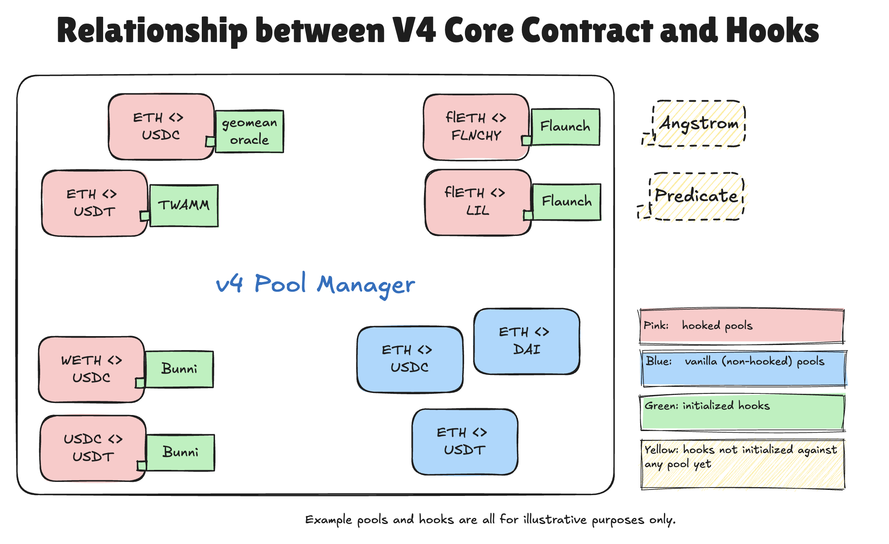

## Hook Standards
Although hooks can include any Solidity code, they all anchor on the [10 core hook functions](https://docs.uniswap.org/contracts/v4/concepts/hooks#core-hook-functions) in Uniswap v4. These functions correspond to key points in a pool’s lifecycle (for example, before/after a swap or liquidity modification) and provide clear “entry points” for customization. For reference, see the [Hooks.sol](https://github.com/Uniswap/v4-core/blob/main/src/libraries/Hooks.sol) contract in the Uni v4 core library and the [BaseHook.sol](https://github.com/OpenZeppelin/uniswap-hooks/blob/master/src/base/BaseHook.sol) template made by OpenZeppelin, which defines all hook entry points.

In addition to these core functions, there are 4 “delta‐returning” flags, bringing the total possible “hook flags” to 14. Each hook contract indicates which of the 14 flags it implements via the final 14 bits of its address (see our [previous v4 data guide](https://uniswapfoundation.mirror.xyz/c7LDDTWhC2ry6gp0nGqcSKHvNHosJmhPQ-ZuIxqeB2I) on how to read these bits). This allows both developers and indexers to quickly determine a hook’s properties. If you’re unfamiliar with return deltas, refer to [Custom Accounting](https://docs.uniswap.org/contracts/v4/guides/custom-accounting), [Unlock Callback & Deltas](https://docs.uniswap.org/contracts/v4/guides/unlock-callback#deltas), and [BeforeSwapDelta](https://docs.uniswap.org/contracts/v4/reference/core/types/beforeswapdelta) in the v4 doc. 

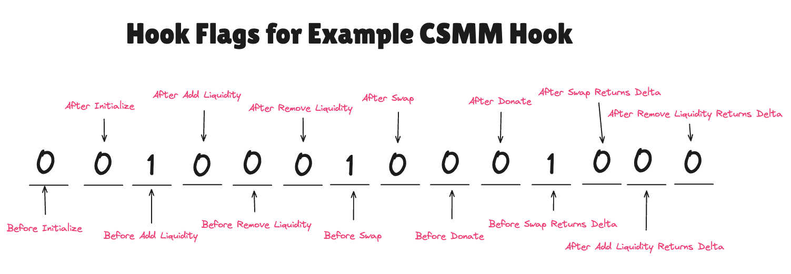

While hooks can do more than just the standard 10 core functions, these functions create a consistent foundation:
- Developers can count on known “entry points” to customize pool behavior.
- Indexers can reliably parse trace data from the same core hook calls across different hooks.

In many cases, hooks will simply modify or extend the normal v4 `PoolManager` flow and thus inherit the usual events from the Uniswap v4 core contract. However, some hooks may bypass or replace certain logic, causing the default v4 events to be skipped or rendered inaccurate. To fill that gap—and ensure accurate metrics for volume, TVL, and fees—we propose a set of hook‐specific events. By emitting them at the right times, hooks remain discoverable, analytics stay reliable, and LPs get a complete risk–reward picture.
We’re collaborating with OpenZeppelin to include these standards in the [Uniswap Hooks library](https://github.com/OpenZeppelin/uniswap-hooks/tree/master) and working with [Atrium Academy](https://x.com/atriumacademy?lang=en) to adopt them in developer training. As with any major standard (e.g., ERC20, EIP1559), broad community support is the key to success.

### Standard Hook Events

**We strongly encourage you to emit these events so that developers, LPs, analysts, and users can all share a unified framework for interpreting hook data.** By following this standard, you will also gain access to open‐source repos that we are developing, making it easy to retrieve your hook’s metrics, integrate them into front‐end displays, and leverage them for internal analytics—ensuring your hook remains visible and valuable within the broader ecosystem.

```
event HookSwap(
    bytes32 indexed id,       // v4 pool id
    address indexed sender,   // router of the swap
    int128 amount0,
    int128 amount1,
    uint128 hookLPfeeAmount0,
    uint128 hookLPfeeAmount1
);

event HookFee(
    bytes32 indexed id,       // v4 pool id
    address indexed sender,   // router of the swap
    uint128 feeAmount0,
    uint128 feeAmount1
);

event HookModifyLiquidity(
    bytes32 indexed id,       // v4 pool id
    address indexed sender,   // router address
    int128 amount0,
    int128 amount1
);

event HookBonus(
    bytes32 indexed id,       // v4 pool id
    uint128 amount0,
    uint128 amount1
);

```

### Use Case Flow Charts
The following diagrams illustrate when to emit each event during a hook’s lifecycle. Remember, these scenarios can overlap. Your hook might be both “custom curve” and “hook fee” at once, so you would emit events for both flows.

#### Custom Curve
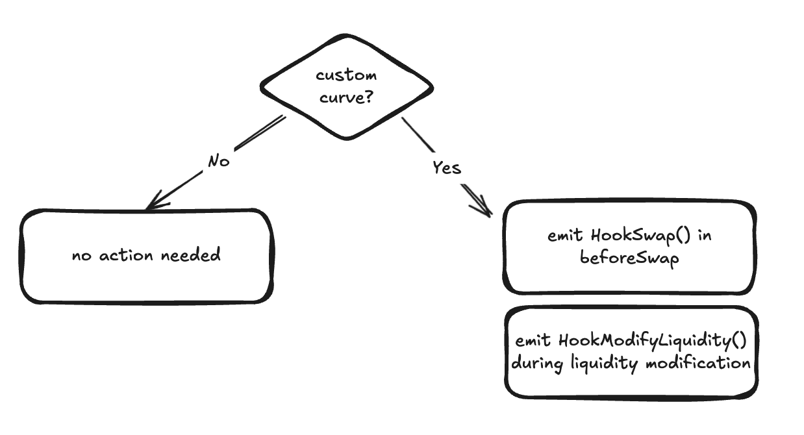

In v4, developers can bypass the built-in v3 concentrated liquidity by using [custom accounting](https://docs.uniswap.org/contracts/v4/guides/custom-accounting), allowing them to implement their own swap curves. This enables custom liquidity provisioning and swap logic. [Custom curves](https://www.v4-by-example.org/hooks/custom-curve) are enabled through `Hooks.BEFORE_SWAP_FLAG` and `Hooks.BEFORE_SWAP_RETURNS_DELTA_FLAG`. Examples of such curves include:

- [Constant sum curve](https://github.com/saucepoint/v4-constant-sum)
- [StableSwap](https://docs.curve.fi/stableswap-exchange/overview/)
- [LAMMbert](https://github.com/euler-mab/LAMMbert/blob/main/LAMMbert.pdf)
- Asymmetric curves
- Dynamic curves
- Step-wise curve

Since these custom curves bypass the built-in `ModifyLiquidity` event emissions and produce incorrect `Swap` event information, we strongly recommend emitting `HookSwap` and `HookModifyLiquidity` events within the hook contract.


#### Async Swap

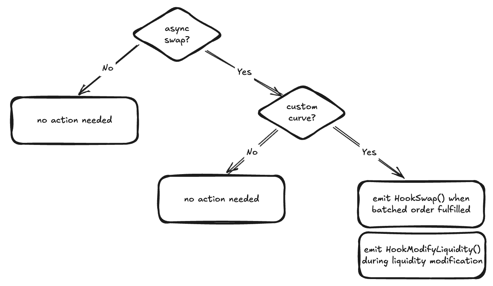

Async swaps defer swap execution to a later time, allowing hooks to control the order of swaps and protect swappers from MEV sandwich attacks. In addition, async swaps can also replace the v4 swap logic with custom curves, effectively bypassing v3-like swap implementation.

[Async swaps](https://docs.uniswap.org/contracts/v4/quickstart/hooks/async-swap) are enabled using `Hooks.BEFORE_SWAP_FLAG` and `Hooks.BEFORE_SWAP_RETURNS_DELTA_FLAG`. Due to the batch-based execution model, we recommend emitting the `HookSwap` event at the time of batch fulfillment rather than for each individual swap.

You can find an async swap template developed by OpenZeppelin [here](https://github.com/OpenZeppelin/uniswap-hooks/blob/master/src/base/BaseAsyncSwap.sol).

#### Hook Fee
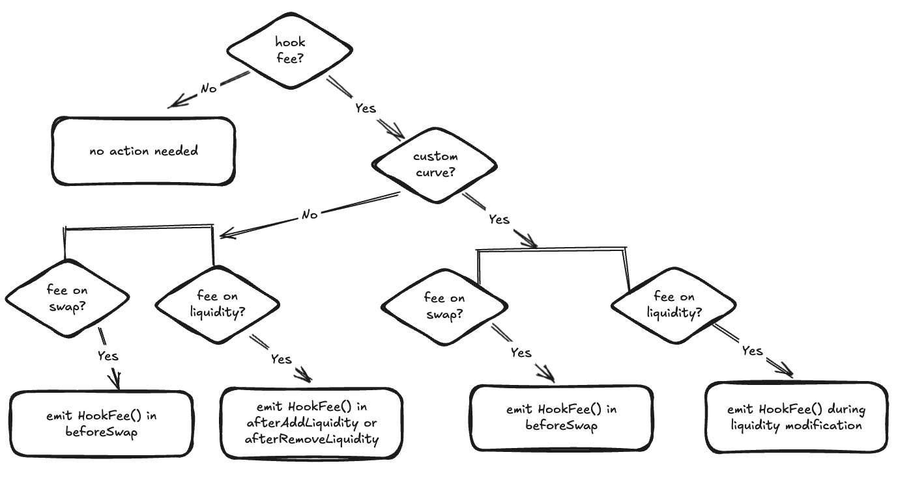

Hooks can optionally charge fees on swaps or liquidity modifications, either as a fixed amount or dynamically calculated. If a hook provides a valuable service to swappers, it may choose to take fees during swaps. Similarly, hooks can impose fees on liquidity modifications. For example, a hook might penalize Just-In-Time (JIT) liquidity by charging a high fee for liquidity removal within a specific time frame. For an example of implementing a static hook fee, [check this out](https://www.v4-by-example.org/fees/fixed-hook-fee).

#### Hook Bonus
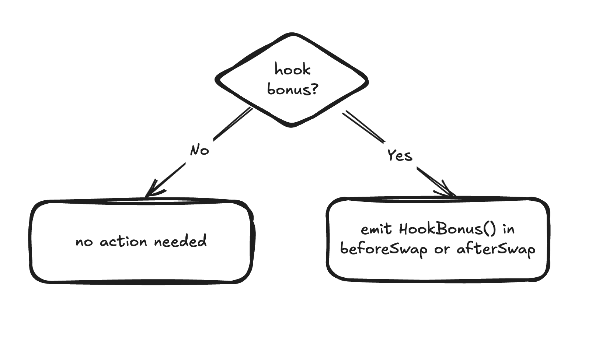

A hook bonus is the opposite of a hook fee—rather than charging swappers, hooks rebate users to incentivize swapping through pools that implement these bonus mechanisms. Hooks can achieve this using the return-delta-flags, i.e. `BEFORE_SWAP_RETURNS_DELTA_FLAG` and/or `AFTER_SWAP_RETURNS_DELTA_FLAG`.

### For Data Indexers

Now that we’ve covered how developers would integrate hook standards, let’s discuss how to index hook data effectively.

#### 1. Identifying Initialized Hooks
- Monitor Initialize events from the v4 PoolManager during pool creation.
- This event indicates whether a pool is hooked (you’ll see a valid hook address) or a vanilla pool (the address is the null address).
- By tracking these addresses, you can compile a complete list of initialized hooks for data indexing.

#### 2. Indexing Hook Activity
- All initialized hooks implement the 10 core hook functions and should emit the standard hook events we covered.
- By monitoring both logs and trace data for these functions and events (see the ABI in appendix), you can capture each hook’s activity in a consistent, standardized manner.

## Hook Metrics

Congrats on making it this far—we’re almost at the finish line!

Now that we’ve explored hooks' relationship with Uniswap v4, along with hook standards and various use case flows, it’s time to tackle metrics. Establishing a shared terminology ensures that when we discuss hook-related and v4 metrics, we all have a clear and consistent understanding.

We'll focus on the two key metric categories—TVL and volume. Below, we’ll define these metrics and provide recommendations for their calculation.

### TVL (Total Value Locked)

#### Overall TVL
The overall TVL in Uniswap v4 is the total value (typically in USD) of all liquidity locked in the protocol. This includes liquidity held within the singleton v4 Pool Manager contract and any liquidity locked in external, initialized hook contracts. A hook contract is considered "initialized" once it is registered with at least one Uniswap v4 pool.

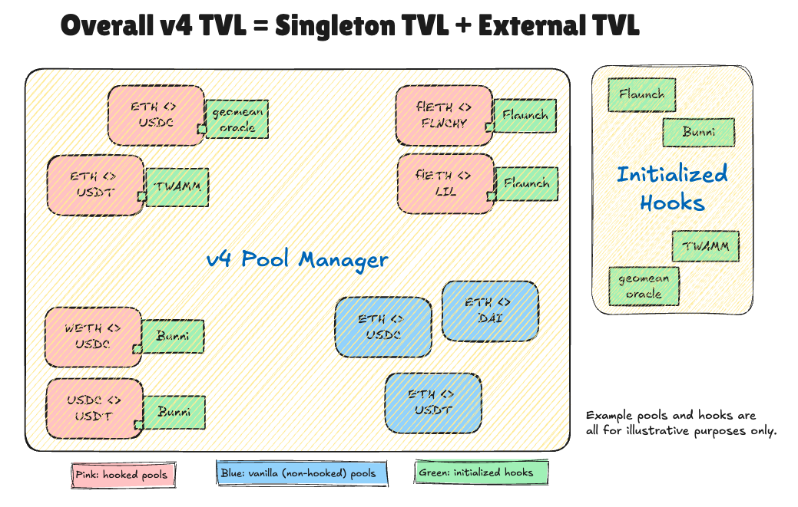

#### Singleton TVL
Singleton TVL refers to the portion of total liquidity held exclusively within Uniswap v4’s core (singleton) Pool Manager contract. Even if a pool is initialized with an external hook, the singleton TVL counts only the assets locked in the core contract itself, excluding any external liquidity held by hook contracts.

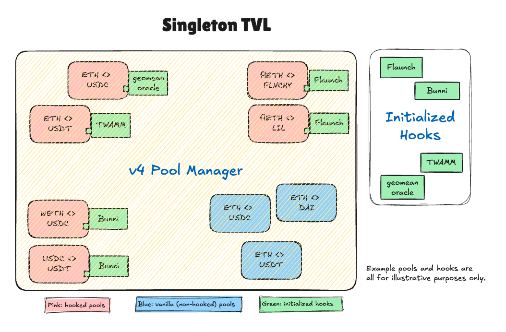

#### External TVL
External TVL is the total liquidity held outside the Uniswap v4 core Pool Manager contract, specifically within initialized hook contracts. A hook contract is considered "initialized" once it is registered with at least one Uniswap v4 pool.

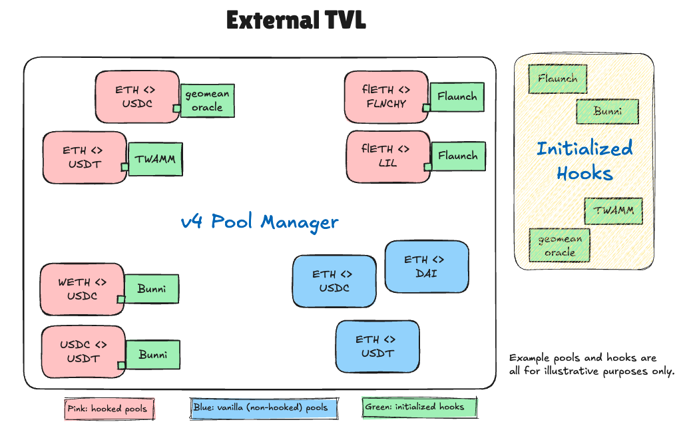

#### Hook TVL 
Hook TVL is the total liquidity in pools that utilize hooks. It includes both regular hooked pools, where liquidity remains in the Uniswap v4 Pool Manager contract, and special hooked pools (e.g., custom curves), where liquidity resides in external hook contracts.

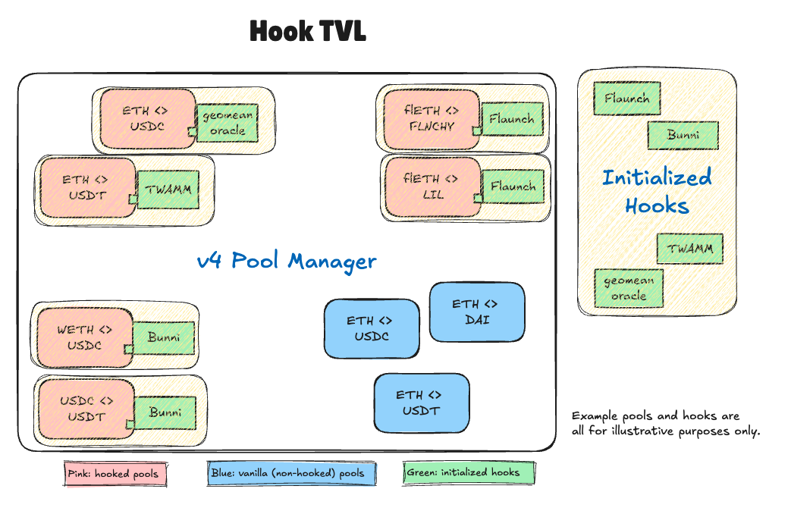

:::note 
**Note on Advanced Hook Scenarios**

Hooks can introduce more complex liquidity flows that extend beyond the simple “locked” model described above. For example, rehypothecation hooks may deploy liquidity into external lending protocols, where it earns yield rather than remaining in the v4 Pool Manager contract. Similarly, just-in-time (JIT) liquidity hooks may pull liquidity in from elsewhere only when needed for a swap. These scenarios mean that the “TVL” in v4 (both Singleton and External) may differ from the actual capital being utilized for swaps or residing in the protocol at any given moment.
We are actively collaborating with the broader Uniswap community and hook developers to refine our TVL definitions and measurement methods for these advanced use cases. We’ll share updates on these revised TVL standards as soon as they’re finalized.
:::

#### Calculation
TVL can be determined in two ways:

1. Tracking Liquidity Modification Events – Monitor liquidity changes, including swaps, to net the total liquidity.
2. Tracking Token Flows – Measure inflows and outflows across relevant contracts.

At the pool level, TVL can no longer be derived solely from token flows due to v4’s singleton architecture. However, for broader overall TVL calculations, tracking token flows is often more efficient than monitoring liquidity modification events.

### Volume
Volume represents the total trading activity (typically in USD) on Uniswap v4, measured per trade. For example, swapping 2,673.83 USDC for 1 ETH (using the ETH price at Feb 13, 5:23 PM ET) counts as $2,673.83 in volume—not double the amount from both assets in the trade.

#### Total Volume (over a period)
Total Volume (over a period) is the cumulative trading volume across all Uniswap v4 pools within a given timeframe, including both vanilla and hooked pools.

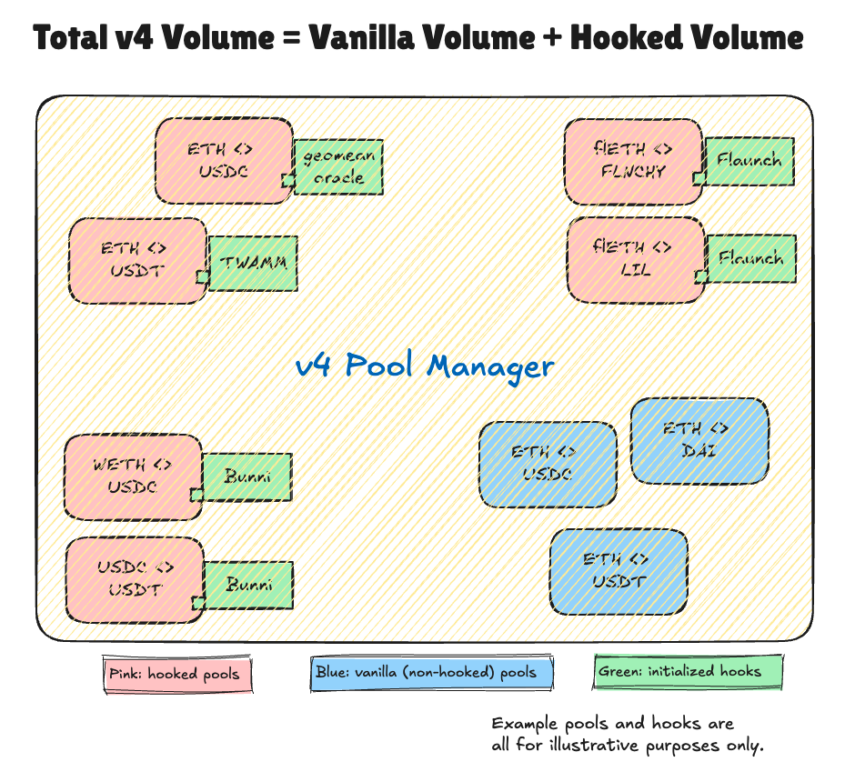

#### Hooked Volume (over a period)
Hooked Volume (over a period) is the total trading volume in hooked pools over a given timeframe. This includes swap amounts facilitated by return delta hooks (e.g., custom curves or async swaps) that use their own custom logic and/or liquidity.
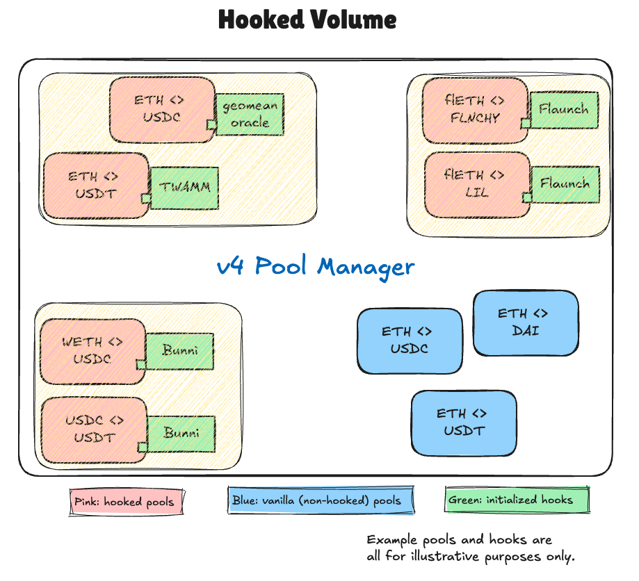

#### Vanilla Volume (over a period)
Vanilla Volume (over a period) is the total trading volume in vanilla pools—i.e., pools that are not initialized with any hooks.
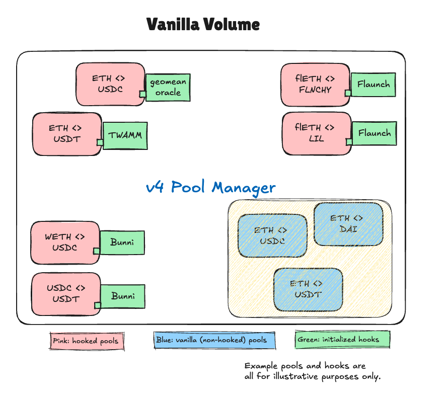


#### Calculation
To accurately measure trading volume in Uniswap v4, there are two main approaches:
1. Event-Based Tracking – You can track emitted events, but to get a complete picture, you must monitor both:
    - Swap events from the v4 core contract.
    - HookSwap events from delta-returning hook contracts (e.g., custom curves). Relying only on Swap events will miss volume facilitated by delta-returning hooks.
2. Trace Data Indexing – A more holistic approach is to index the trace data of the [swap function call in v4](https://github.com/Uniswap/v4-core/blob/80311e34080fee64b6fc6c916e9a51a437d0e482/src/PoolManager.sol#L185). This requires parsing the `swapDelta` field based on the swap parameters to reconstruct `amount0` and `amount1`. This method ensures all swaps are captured, including those processed through delta-returning hooks.

You can already query holistic volume from `dex.trades` on Dune and Allium, which use trace data indexing. We're also working with Uniswap Labs to apply this to the v4 open-source subgraph.


## Parting Words
We hope this guide helps bring clarity to the landscape of Uniswap v4 hook data—from standards and events to indexing and analytics. As we wrap up, here are our key calls to action:

- Hook Developers: Adopt the four standard events and emit them at the recommended points to ensure seamless integration across the ecosystem. Following this standard allows you to leverage our upcoming open-source repo to easily access your hook’s metrics, display them on front-end interfaces, and conduct internal analysis. This keeps your hook visible within the broader ecosystem while saving your team significant development time.
- Indexers & Analysts: Update your pipelines to detect hooks on initialization and parse the standard hook events. This ensures comprehensive coverage of swaps, fees, and liquidity changes in v4.

By working together—much like how ERC20 or EIP1559 standards emerged—we can shape a consistent, discoverable, and transparent future for Uniswap v4 hooks!

:::info 
Join the conversation on v4 hook data standards in our Telegram group: https://t.me/v4_hooks_data.
:::

## _Appendix_
### Standard Hook ABI
```
[{"anonymous":false,"inputs":[{"indexed":true,"internalType":"bytes32","name":"id","type":"bytes32"},{"indexed":true,"internalType":"address","name":"sender","type":"address"},{"indexed":false,"internalType":"int128","name":"amount0","type":"int128"},{"indexed":false,"internalType":"int128","name":"amount1","type":"int128"},{"indexed":false,"internalType":"uint128","name":"hookLPfeeAmount0","type":"uint128"},{"indexed":false,"internalType":"uint128","name":"hookLPfeeAmount1","type":"uint128"}],"name":"HookSwap","type":"event"},{"anonymous":false,"inputs":[{"indexed":true,"internalType":"bytes32","name":"id","type":"bytes32"},{"indexed":true,"internalType":"address","name":"sender","type":"address"},{"indexed":false,"internalType":"uint128","name":"feeAmount0","type":"uint128"},{"indexed":false,"internalType":"uint128","name":"feeAmount1","type":"uint128"}],"name":"HookFee","type":"event"},{"anonymous":false,"inputs":[{"indexed":true,"internalType":"bytes32","name":"id","type":"bytes32"},{"indexed":true,"internalType":"address","name":"sender","type":"address"},{"indexed":false,"internalType":"int128","name":"amount0","type":"int128"},{"indexed":false,"internalType":"int128","name":"amount1","type":"int128"}],"name":"HookModifyLiquidity","type":"event"},{"anonymous":false,"inputs":[{"indexed":true,"internalType":"bytes32","name":"id","type":"bytes32"},{"indexed":false,"internalType":"uint128","name":"amount0","type":"uint128"},{"indexed":false,"internalType":"uint128","name":"amount1","type":"uint128"}],"name":"HookBonus","type":"event"},{"inputs":[{"internalType":"address","name":"","type":"address"},{"components":[{"internalType":"Currency","name":"currency0","type":"address"},{"internalType":"Currency","name":"currency1","type":"address"},{"internalType":"uint24","name":"fee","type":"uint24"},{"internalType":"int24","name":"tickSpacing","type":"int24"},{"internalType":"contract IHooks","name":"hooks","type":"address"}],"internalType":"struct PoolKey","name":"","type":"tuple"},{"internalType":"uint160","name":"","type":"uint160"}],"name":"beforeInitialize","outputs":[{"internalType":"bytes4","name":"","type":"bytes4"}],"stateMutability":"nonpayable","type":"function"},{"inputs":[{"internalType":"address","name":"","type":"address"},{"components":[{"internalType":"Currency","name":"currency0","type":"address"},{"internalType":"Currency","name":"currency1","type":"address"},{"internalType":"uint24","name":"fee","type":"uint24"},{"internalType":"int24","name":"tickSpacing","type":"int24"},{"internalType":"contract IHooks","name":"hooks","type":"address"}],"internalType":"struct PoolKey","name":"","type":"tuple"},{"internalType":"uint160","name":"","type":"uint160"},{"internalType":"int24","name":"","type":"int24"}],"name":"afterInitialize","outputs":[{"internalType":"bytes4","name":"","type":"bytes4"}],"stateMutability":"nonpayable","type":"function"},{"inputs":[{"internalType":"address","name":"","type":"address"},{"components":[{"internalType":"Currency","name":"currency0","type":"address"},{"internalType":"Currency","name":"currency1","type":"address"},{"internalType":"uint24","name":"fee","type":"uint24"},{"internalType":"int24","name":"tickSpacing","type":"int24"},{"internalType":"contract IHooks","name":"hooks","type":"address"}],"internalType":"struct PoolKey","name":"","type":"tuple"},{"components":[{"internalType":"int24","name":"tickLower","type":"int24"},{"internalType":"int24","name":"tickUpper","type":"int24"},{"internalType":"int256","name":"liquidityDelta","type":"int256"},{"internalType":"bytes32","name":"salt","type":"bytes32"}],"internalType":"struct IPoolManager.ModifyLiquidityParams","name":"","type":"tuple"},{"internalType":"bytes","name":"","type":"bytes"}],"name":"beforeAddLiquidity","outputs":[{"internalType":"bytes4","name":"","type":"bytes4"}],"stateMutability":"pure","type":"function"},{"inputs":[{"internalType":"address","name":"","type":"address"},{"components":[{"internalType":"Currency","name":"currency0","type":"address"},{"internalType":"Currency","name":"currency1","type":"address"},{"internalType":"uint24","name":"fee","type":"uint24"},{"internalType":"int24","name":"tickSpacing","type":"int24"},{"internalType":"contract IHooks","name":"hooks","type":"address"}],"internalType":"struct PoolKey","name":"","type":"tuple"},{"internalType":"uint256","name":"amountPerToken","type":"uint256"}],"name":"afterAddLiquidity","outputs":[],"stateMutability":"nonpayable","type":"function"}]

```