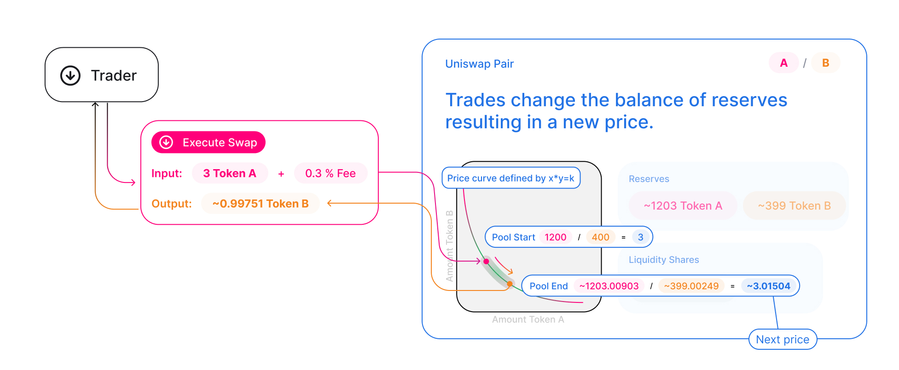

# Introduction

Token swaps in Uniswap are a simple way to trade one ERC-20 token for another.

For end-users, swapping is intuitive: a user picks an input token and an output token. They specify an input amount, and the protocol calculates how much of the output token they’ll receive. They then execute the swap with one click, receiving the output token in their wallet immediately.

In this guide, we’ll look at what happens during a swap at the protocol level in order to gain a deeper understanding of how Uniswap works.

Swaps in Uniswap are different from trades on traditional platforms. Uniswap does not use an order book to represent liquidity or determine prices. Uniswap uses an automated market maker mechanism to provide instant feedback on rates and slippage.

As we learned in [Protocol Overview](../protocol-overview/how-uniswap-works), each pair on Uniswap is actually underpinned by a liquidity pool. Liquidity pools are smart contracts that hold balances of two unique tokens and enforces rules around depositing and withdrawing them.

This rule is the [constant product formula](../protocol-overview/glossary#constant-product-formula). When either token is withdrawn (purchased), a proportional amount of the other must be deposited (sold), in order to maintain the constant.

## Anatomy of a swap

At the most basic level, all swaps in Uniswap V2 happen within a single function, aptly named `swap`:

```solidity
function swap(uint amount0Out, uint amount1Out, address to, bytes calldata data);
```

# Receiving tokens

As is probably clear from the function signature, Uniswap requires `swap` callers to _specify how many output tokens they would like to receive_ via the `amount{0,1}Out` parameters, which correspond to the desired amount of `token{0,1}`.

# Sending Tokens

What’s not as clear is how Uniswap _receives_ tokens as payment for the swap. Typically, smart contracts which need tokens to perform some functionality require callers to first make an approval on the token contract, then call a function that in turn calls transferFrom on the token contract. This is _not_ how V2 pairs accept tokens. Instead, pairs check their token balances at the _end_ of every interaction. Then, at the beginning of the _next_ interaction, current balances are differenced against the stored values to determine the amount of tokens that were sent by the current interactor. See the <a href='/whitepaper.pdf' rel='noopener noreferrer'>whitepaper</a> for a justification of why this is the case.

The takeaway is that **tokens must be transferred to pairs before swap is called** (the one exception to this rule is [Flash Swaps](flash-swaps)). This means that to safely use the `swap` function, it must be called from _another smart contract_. The alternative (transferring tokens to the pair and then calling `swap`) is not safe to do non-atomically because the sent tokens would be vulnerable to arbitrage.

# Developer resources

- To see how to implement token swaps in a smart contract read [Trading from a smart contract](../../guides/smart-contract-integration/trading-from-a-smart-contract).
- To see how to execute a swap from an interface read [Trading (SDK)](../../../../sdk/2.0.0/guides/trading)
