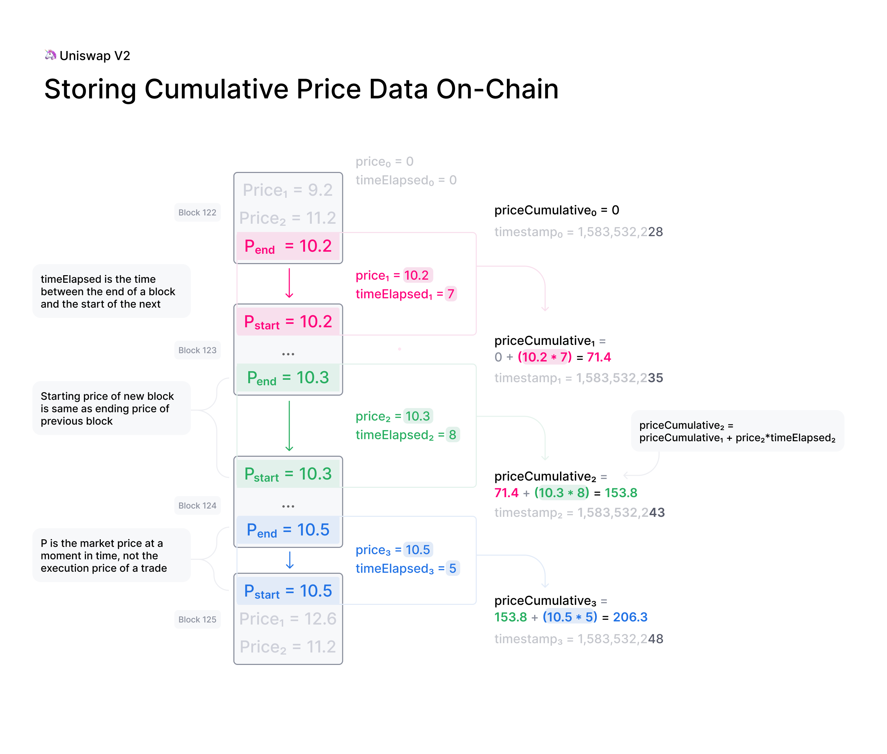
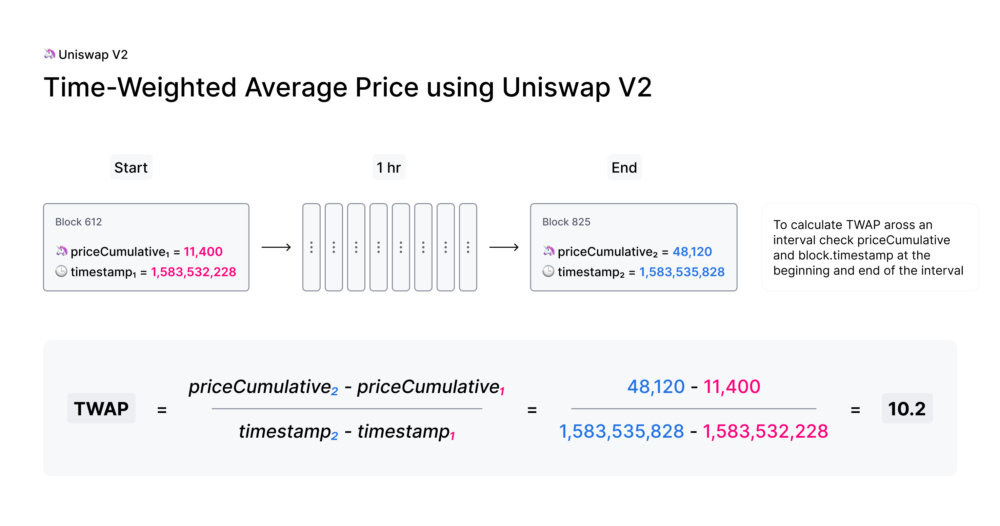

# Introduction

A price oracle is any tool used to view price information about a given asset. When you look at stock prices on your phone, you are using your phone as a price oracle. Similarly, the app on your phone relies on devices to retrieve price information - likely several, which are aggregated and then displayed to you, the end-user. These are price oracles as well.

When building smart contracts that integrate with DeFi protocols, developers will inevitably run into the price oracle problem. What is the best way to retrieve the price of a given asset on-chain?

Many oracle designs on Ethereum have been implemented on an ad-hoc basis, with varying degrees of decentralization and security. Because of this, the ecosystem has witnessed numerous high-profile hacks where the oracle implementation is the primary attack vector.
Some of these vulnerabilities are discussed [here](https://samczsun.com/taking-undercollateralized-loans-for-fun-and-for-profit/).

While there is no one size fits all solution, Uniswap V2 enables developers to build highly decentralized and manipulation-resistant on-chain price oracles, which may solve many of the demands necessary for building robust protocols.

# Uniswap V2 solution

Uniswap V2 includes several improvements for supporting manipulation-resistant public price feeds. First, every pair measures (but does not store) the market price at the beginning of each block, before any trades take place. This price is expensive to manipulate because it is set by the last transaction, whether it is a mint, swap, or burn, in a previous block.

**To set the measured price to one that is out of sync with the global market price, an attacker has to make a bad trade at the end of a previous block** , typically with no guarantee that they will arbitrage it back in the next block. Attackers will lose money to arbitrageurs unless they can “selfishly” mine two blocks in a row. This type of attack presents several challenges and [has not been observed to date](https://arxiv.org/abs/1912.01798).

Unfortunately, this alone is not enough. If significant value settles based on the price resulting from this mechanism, an attack’s profit will likely outweigh the loss.

Instead, Uniswap V2 adds this end-of-block price to a single cumulative-price variable in the core contract weighted by the amount of time this price existed. **This variable represents a sum of the Uniswap price for every second in the entire history of the contract.**

This variable can be used by external contracts to track accurate time-weighted average prices (TWAPs) across any time interval.

The TWAP is constructed by reading the cumulative price from an ERC20 token pair at the beginning and at the end of the desired interval. The difference in this cumulative price can then be divided by the length of the interval to create a TWAP for that period.

TWAPs can be used directly or as the basis for moving averages (EMAs and SMAs) as needed.

A few notes:

- For a 10-minute TWAP, sample once every 10 minutes. For a 1-week TWAP, sample once every week.
- For a simple TWAP, the cost of manipulation increases (approx. linear) with liquidity on Uniswap, as well as (approx. linear) with the length of time over which you average.
- The Cost of an attack is relatively simple to estimate. Moving the price 5% on a 1-hour TWAP is approximately equal to the amount lost to arbitrage and fees for moving the price 5% every block for 1 hour.

There are some nuances that are good to be aware of when using Uniswap V2 as an oracle, especially where manipulation resistance is concerned. The <a href='/whitepaper.pdf' target='_blank' rel='noopener noreferrer'>whitepaper</a> elaborates on some of them. Additional oracle-focused developer guides and documentation will be released soon.

In the meantime, check out our [example implementation](https://github.com/Uniswap/uniswap-v2-periphery/blob/master/contracts/examples/ExampleOracleSimple.sol) of a 24 hr TWAP Oracle built on Uniswap V2!

## Manipulation resistance

The cost of manipulating the price for a specific time period can be roughly estimated as the amount lost to arbitrage and fees every block for the entire period. For larger liquidity pools and over longer time periods, this attack is impractical, as the cost of manipulation typically exceeds the value at stake.

Other factors, such as network congestion, can reduce the cost of attack. For a more in-depth review of the security of Uniswap V2 price oracles, read the [security audit section on Oracle Integrity](https://niftyleague.com/audit.html#org87c8b91).

# Building an oracle

To learn more about building oracles check out [building an Oracle](../../guides/smart-contract-integration/building-an-oracle) in the developer guides.
